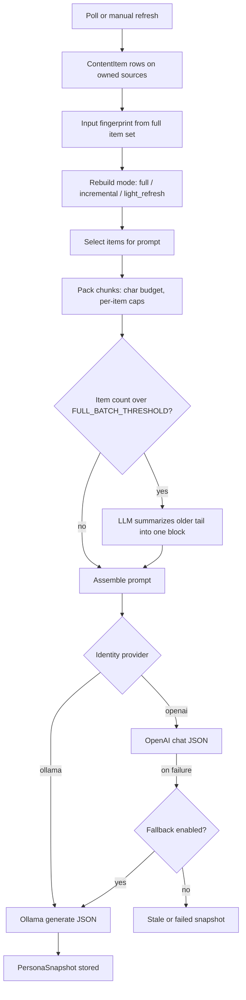

# Synapse

**Synapse** is a Flask application for **research-intelligence style ingestion and curation**: it polls **RSS feeds** and **HTML pages**, stores normalized **content items**, builds **structured personas** (people, organizations, places) from that evidence using **LLMs**, powers an optional **Hub-centric lead reporting** pipeline, and exposes a **public website** for discovery plus a **password-protected admin** workspace for operators.

It was built in the context of **Neurotech Hub** workflows but the architecture is domain-agnostic: prompts and entity models can evolve toward other verticals.

---

## What this app does

| Area | Behavior |
|------|------------|
| **Ingestion** | Scheduled **Poll now** jobs fetch RSS entries and HTML snapshots; new material becomes **`ContentItem`** rows (deduped per source). HTML changes are tracked via snapshot hashing. |
| **Public intake** | Visitors can **submit URLs** on the public site; submissions become **`Source`** rows (often **pending**) for admin review before polling. |
| **Admin curation** | Operators approve sources, attach them to **people** or **organizations**, edit items, and run **public Latest** curation (LLM-assisted verdicts on what to show). |
| **Personas** | For each person, organization, or building/place, Synapse maintains a **`PersonaSnapshot`**: JSON-aligned fields (focus, methods, keywords, projects, notes, etc.) produced from owned-source evidence. Rebuilds can be **full**, **incremental**, or **light**, with character budgets and tail summarization to stay within model context. |
| **Rollups** | Organization and **building/place** personas can synthesize member personas plus source excerpts. A designated **Hub** organization can load persona text from a bundled JSON file instead of the LLM. |
| **Lead reports** | **Leads** ties a **Hub corpus** config and prompts to multi-step **`LeadReport`** jobs that consolidate Hub and target evidence (optional long-running background thread). |
| **Geography** | **Regions** (polygons) and **buildings** link to organizations for map-oriented UX where implemented. |
| **MCP** | Optional **stdio MCP server** exposes read-only tools over the same DB-backed retrieval layer (`docs/mcp.md`), including optional **OpenAI ChatGPT-style** `search` / `fetch` shapes when enabled. |

**LLM usage at a glance:** **Personas** default to **OpenAI** when `OPENAI_API_KEY` is set; **HTML page title/snippet enrichment**, **lead reports**, and **public feed curation** default to **Ollama** unless you override provider env vars (see [LLM configuration](#llm-configuration-and-context-overflow-flow)). Install the **`openai`** package in the **same Python environment** as the Flask app (`python -m pip install openai`).

---

## Surfaces

| Surface | Path | Role |
|---------|------|------|
| **Public** | `/` | Landing, URL submit (canonicalized URLs, duplicate handling, rate limits), listings and detail pages for people/organizations and **Latest** content cards. |
| **Admin** | `/admin/` | Dashboard (**Poll now**, poll logs, persona health hints), CRUD for **people**, **organizations**, **buildings**, **regions**, **sources**, **content items**, **snapshots**; **Leads** (Hub settings, lead reports); identity refresh actions. |

Authentication: **`ADMIN_PASSWORD`** or **`ADMIN_PASSWORD_HASH`**. On **debug** + loopback, login may be bypassed for local dev—see [Configuration](#configuration).

---

## Technical stack

| Layer | Choice |
|-------|--------|
| **App** | Flask 3, Flask-Login (single operator user), Flask-WTF, Flask-Limiter |
| **Data** | SQLAlchemy 2 + Flask-Migrate (Alembic); default **SQLite** at `instance/synapse.db`, optional **Postgres** via `DATABASE_URL` |
| **Entry** | [`run.py`](run.py) for dev, [`wsgi.py`](wsgi.py) for `flask` / `gunicorn` |
| **LLM** | Routed in [`app/ingest/llm_client.py`](app/ingest/llm_client.py): OpenAI Chat Completions + JSON mode for structured tasks; Ollama HTTP for local models |
| **Tests** | `pytest`; optional integration against a live Ollama daemon (`pytest -m ollama`) |

---

## Repository map (quick orientation)

| Path | Contents |
|------|----------|
| [`app/identity/`](app/identity/) | Persona build/rollup, evidence packing, staleness, rebuild modes |
| [`app/ingest/`](app/ingest/) | Poll pipeline, RSS/HTML helpers, `llm_client`, Ollama/OpenAI backends |
| [`app/leads/`](app/leads/) | Lead report pipeline, Hub corpus helpers, progress |
| [`app/public_feed/`](app/public_feed/) | Public Latest curation batches |
| [`app/web/`](app/web/) | [`public_routes.py`](app/web/public_routes.py), [`admin/routes.py`](app/web/admin/routes.py) |
| [`app/mcp/`](app/mcp/) | Optional MCP stdio server |
| [`prompts/`](prompts/) | Externalized LLM templates |
| [`migrations/`](migrations/) | Alembic versions |
| [`docs/`](docs/) | [Ollama runbook](docs/ollama.md), [MCP notes](docs/mcp.md) |

---

## Run locally

### One-time setup

```bash
python3 -m venv .venv && source .venv/bin/activate   # omit `source …` on Windows
pip install -r requirements-dev.txt
export ADMIN_PASSWORD='local-only'   # or use ADMIN_PASSWORD_HASH (see below)
flask --app wsgi db upgrade          # first run and after migrations
```

Install **`openai`** in this same venv if you use OpenAI-backed personas:

```bash
python -m pip install openai
```

### Start the server

```bash
python run.py    # http://127.0.0.1:5002 — or set SYNAPSE_PORT
```

**Alternative:**

```bash
SYNAPSE_PORT=5002 flask --app wsgi run --debug --host 127.0.0.1 --port 5002
```

**VS Code / Cursor:** open [`run.py`](run.py), select the interpreter that uses `.venv`, then **Run Python File** or the **Synapse: run.py** launch config under Run and Debug.

### URLs

| Surface | Address |
|---------|---------|
| Public | [http://127.0.0.1:5002/](http://127.0.0.1:5002/) |
| Admin | [http://127.0.0.1:5002/admin/](http://127.0.0.1:5002/admin/) |

The **Hub corpus organization** is chosen under **Leads → Hub settings**. Per-source **Neurotech Hub** tagging and owners drive which ingests feed Hub lead reports. Evidence caps and LLM routing are documented in [LLM configuration](#llm-configuration-and-context-overflow-flow).

---

## LLM configuration and context overflow flow

Synapse routes model calls through [`app/ingest/llm_client.py`](app/ingest/llm_client.py): **personas** default to **OpenAI** when `OPENAI_API_KEY` is set, and **HTML page summarization** defaults to **Ollama**. **Lead reports** and **public Latest curation** default to Ollama unless you point them at OpenAI.

### End-to-end flow (persona / identity)



- **Overflow packing:** [`app/identity/evidence.py`](app/identity/evidence.py) concatenates evidence up to **`SYNAPSE_IDENTITY_CONTENT_BUDGET_CHARS`** (total). The first **`SYNAPSE_IDENTITY_FULL_TEXT_ITEMS`** items get longer excerpts (capped by **`SYNAPSE_IDENTITY_CHUNK_MAX_CHARS`**); later items get shorter slices so the prompt stays within budget.
- **Large corpora:** If the *selected* item count exceeds **`SYNAPSE_IDENTITY_FULL_BATCH_THRESHOLD`**, the list is split: the head is packed in full, and the **tail** is sent through **`run_identity_llm`** once as a compact “batch summary” block (template `prompts/content_batch_summary.txt`) so the main persona call still fits context.
- **Rebuild modes** (env defaults in [`app/identity/rebuild_modes.py`](app/identity/rebuild_modes.py)):

  | Trigger | Env | Default |
  |---------|-----|---------|
  | After poll burst (`rebuild_person_identities_bounded`) | `SYNAPSE_POLL_PERSONA_REBUILD_MODE` | `incremental` |
  | Dashboard “refresh stale ready” batch | `SYNAPSE_DASH_IDENTITY_REBUILD_MODE` (alias `SYNAPSE_DASHBOARD_IDENTITY_REBUILD_MODE`) | `incremental` |
  | Admin “rebuild persona” button | `SYNAPSE_MANUAL_PERSONA_REBUILD_MODE` | `full` |
  | Poll burst size | `SYNAPSE_POLL_IDENTITY_BURST` | `6` |

  Incremental mode restricts to a recent window (**`SYNAPSE_IDENTITY_INCREMENTAL_DAYS`**, **`SYNAPSE_IDENTITY_INCREMENTAL_MAX_ITEMS`**); light mode caps items (**`SYNAPSE_IDENTITY_LIGHT_MAX_ITEMS`**). Incremental/light require an existing ok snapshot with `generated_at`, otherwise the run upgrades to **full**.

### Provider selection and fallbacks

| Task | Default | Override | On primary failure |
|------|---------|----------|---------------------|
| Persona (person / org / building) | OpenAI if `OPENAI_API_KEY` else Ollama | `SYNAPSE_LLM_IDENTITY_PROVIDER=openai\|ollama` | `SYNAPSE_LLM_IDENTITY_FALLBACK_OLLAMA` (default on) → Ollama |
| Hub lead reports | Ollama | `SYNAPSE_LLM_LEAD_PROVIDER` | `SYNAPSE_LLM_LEAD_FALLBACK_OLLAMA` (default on) |
| Public feed curation | Ollama | `SYNAPSE_LLM_PUBLIC_FEED_PROVIDER` | `SYNAPSE_LLM_PUBLIC_FEED_FALLBACK_OLLAMA` (default on) |

### OpenAI (API key required for these paths)

| Variable | Purpose |
|----------|---------|
| `OPENAI_API_KEY` | Enables default OpenAI routing for personas when provider is auto. |
| `SYNAPSE_OPENAI_IDENTITY_MODEL` | Chat model for personas (default `gpt-4o-mini`). |
| `SYNAPSE_OPENAI_IDENTITY_TIMEOUT_SEC` | Identity call timeout. |
| `SYNAPSE_OPENAI_IDENTITY_MAX_COMPLETION_TOKENS` | Cap on completion length for JSON persona output. |
| `SYNAPSE_OPENAI_IDENTITY_SYSTEM` | Optional system prompt for identity calls. |
| `SYNAPSE_OPENAI_LEAD_MODEL` | Lead reports when `SYNAPSE_LLM_LEAD_PROVIDER=openai`. |
| `SYNAPSE_OPENAI_LEAD_TIMEOUT_SEC` | Lead report timeout. |
| `SYNAPSE_OPENAI_PUBLIC_FEED_MODEL` | Public feed curation when provider is OpenAI. |
| `SYNAPSE_OPENAI_PUBLIC_FEED_TIMEOUT_SEC` | Curation timeout. |

Listed in [`requirements.txt`](requirements.txt). Use **`python -m pip install openai`** with the **same interpreter** as `python run.py`.

### Ollama (local API)

| Variable | Purpose |
|----------|---------|
| `OLLAMA_HOST` | Base URL (default `http://127.0.0.1:11434`). |
| `OLLAMA_MODEL` | Default generate model tag. |
| `SYNAPSE_HTML_PAGE_LLM` | `0` / false disables LLM title/snippet for `html_page` ingest (heuristics only). |
| `SYNAPSE_HTML_PAGE_LLM_PROMPT_CHARS` / `SYNAPSE_HTML_PAGE_LLM_SNIPPET_TARGET_CHARS` | Page text budget and target snippet size for summarize. |
| `SYNAPSE_OLLAMA_IDENTITY_NUM_CTX` / `SYNAPSE_OLLAMA_IDENTITY_OPTIONS` / `SYNAPSE_OLLAMA_IDENTITY_JSON_FORMAT` | Identity-only Ollama options (large `num_ctx` for long prompts). |
| `SYNAPSE_LEAD_REPORT_NUM_CTX` / `SYNAPSE_LEAD_REPORT_OLLAMA_TIMEOUT` | Lead report context and timeout. |
| `SYNAPSE_PUBLIC_FEED_CURATE_NUM_CTX` / `SYNAPSE_PUBLIC_FEED_CURATE_OLLAMA_TIMEOUT` | Public Latest curation. |

Full Ollama runbook: [docs/ollama.md](docs/ollama.md).

### Identity evidence and caps (overflow tuning)

| Variable | Default (typical) | Role |
|----------|-------------------|------|
| `SYNAPSE_IDENTITY_MAX_ITEMS` | `80` | Max **gathered** items before mode-specific filtering. |
| `SYNAPSE_IDENTITY_SNAPSHOT_CAP` | `40` | Paper-style overlay list length in snapshot metadata. |
| `SYNAPSE_IDENTITY_CONTENT_BUDGET_CHARS` | `56000` | Total character budget for packed evidence in the prompt. |
| `SYNAPSE_IDENTITY_CHUNK_MAX_CHARS` | `4000` | Upper bound per-item excerpt for early “full text” items. |
| `SYNAPSE_IDENTITY_FULL_TEXT_ITEMS` | `14` | How many leading items get the larger excerpt budget before truncation tightens. |
| `SYNAPSE_IDENTITY_FULL_BATCH_THRESHOLD` | `30` | Above this count, tail items are **summarized** via a separate small LLM call. |

### Lead report evidence budgets (Hub pipeline)

These cap what goes into **lead report** prompts (see [`app/leads/lead_report_budgets.py`](app/leads/lead_report_budgets.py)); provider choice is still `SYNAPSE_LLM_LEAD_PROVIDER`.

| Variable | Role |
|----------|------|
| `SYNAPSE_LEAD_REPORT_HUB_ITEMS_MAX` | Max Hub content items in the report prompt. |
| `SYNAPSE_LEAD_REPORT_HUB_SNIPPET_CHARS` | Per-Hub-item snippet truncation. |
| `SYNAPSE_LEAD_REPORT_PERSON_ITEMS_MAX` | Cap on person-owned evidence items. |
| `SYNAPSE_LEAD_REPORT_PERSON_CONTENT_CHARS` | Total character budget for owned-source evidence. |
| `SYNAPSE_LEAD_REPORT_ORG_PEOPLE_MAX` | Max affiliated people for org/place rollups. |
| `SYNAPSE_LEAD_REPORT_PIPELINE_SEMVER` | Bumps fingerprinting when prompt/evidence semantics change. |

Admin sidebar shows **OpenAI** (key / SDK / model) and **Ollama** (reachability / model) when logged in.

**MCP:** read-only tools and optional ChatGPT-style `search` / `fetch` compatibility: [docs/mcp.md](docs/mcp.md).

---

## Configuration

### Database

- Default: SQLite at `instance/synapse.db`.
- Postgres: set `DATABASE_URL` and install `psycopg[binary]` (see comment in [`requirements.txt`](requirements.txt)).
- Production: pair `gunicorn wsgi:app` (or similar) with `SECRET_KEY`, a real DB URL, and admin credentials below.

### Admin login & localhost

| Topic | Detail |
|-------|--------|
| Loopback bypass | With **`python run.py`** (`debug=True`) or **`flask … run --debug`**, **127.0.0.1** / **::1** can access `/admin` **without a password** (dev only). |
| Disable bypass | `export SYNAPSE_DISABLE_LOCAL_ADMIN_BYPASS=1` or run without Flask debug. |
| Bypass without debug | `SYNAPSE_TRUST_LOCALHOST=1` (still loopback-only). |
| Password env | **`ADMIN_PASSWORD`** is **stripped** on read so stray newlines from `.env` do not break login. Prefer **`ADMIN_PASSWORD_HASH`** (`werkzeug.security.generate_password_hash`) in shared/deployed setups. |

Non-debug deployments still require **`ADMIN_PASSWORD`** or **`ADMIN_PASSWORD_HASH`** unless you rely on the localhost bypass flags above.

**Environment variables are not auto-loaded from a `.env` file** unless you use a shell or tool that exports them; set `OPENAI_API_KEY` etc. in the process environment for the same interpreter that runs Flask.

---

## Ollama (optional enrichment)

Synapse talks to Ollama at **`OLLAMA_HOST`** (default `http://127.0.0.1:11434`). If nothing is listening, ingest continues without LLM-filled fields and **`pytest -m ollama`** tests skip.

**macOS — Homebrew**

```bash
brew install ollama
brew services start ollama    # login item — or foreground: `ollama serve`
ollama pull llama3.2          # matches default OLLAMA_MODEL; override if you prefer
```

After install, confirm `ollama` is on your PATH (e.g. `/opt/homebrew/bin/ollama` on Apple Silicon); open a new shell if the command is missing.

**Desktop app (macOS / Linux):** [ollama.com](https://ollama.com) — starts the API in the background.

- **Full runbook** (curl checks, env, troubleshooting): [docs/ollama.md](docs/ollama.md)
- **Quick shell check:** `./scripts/ollama_smoke.sh`

Provider choice, HTML-page LLM toggle, `num_ctx`, timeouts, identity overflow budgets, and lead **evidence caps** are centralized in [LLM configuration](#llm-configuration-and-context-overflow-flow).

**Workflow:** **Poll now** (Dashboard) ingests feeds into content items → configure **Hub corpus organization** and tagging under **Sources** / **Leads** → queue **Hub lead reports** from **Leads**. Report jobs log as **`[lead-report]`** on the Leads page; the Dashboard hides `[lead-report]` and `[lead-qual]` lines from the main poll log strip.

HTML pages still get **ContentItem** rows on each new SHA-256 snapshot; when **`SYNAPSE_HTML_PAGE_LLM`** is enabled, the local model shapes `title`/`snippet` (see LLM section).

---

## Extension points and future directions

These are **intentionally open-ended** suggestions for agents or maintainers exploring roadmap work—not commitments.

| Direction | Notes |
|-----------|--------|
| **HTTP / hosted MCP** | Current MCP is **stdio** only; remote Streamable HTTP or SSE would enable hosted connectors without a child process. |
| **Public or partner API** | Today the product is browser-first; a JSON API could expose listings, persona excerpts, or submission webhooks. |
| **Auth & tenancy** | Single shared admin password; multi-user roles, SSO, or org-scoped tenants would be a product decision plus schema/auth work. |
| **Scheduling** | Poll and persona refresh are largely **admin-triggered** or threaded on-demand; cron/Celery/APS could automate cadence and backoff. |
| **Search & retrieval** | Evidence search is substring/SQL today; embeddings or external search could complement persona quality and MCP tools. |
| **Notifications** | Email/Slack on new high-signal items, failed personas, or completed reports. |
| **Vertical packaging** | Prompts under `prompts/` and persona schema are the main “re-skin” surface for non-neuro domains. |
| **Cost & observability** | Token logging exists for some paths; unified tracing/metrics for OpenAI spend would help production tuning. |

---

## Tests

```bash
python3 -m venv .venv && source .venv/bin/activate
pip install -r requirements-dev.txt
```

| Command | When |
|---------|------|
| `pytest` | Default suite (use a venv on PEP 668–managed Python, e.g. Homebrew). |
| `pytest -m "not ollama"` | CI or machines without Ollama. |
| `pytest -m ollama` | Only Ollama HTTP checks; skips if the daemon is down or models are missing. |
| `pytest -m "ollama and not slow"` | Ollama checks **without** the long generate probe. |

`tests/test_ollama_install.py` marks integration tests with `@pytest.mark.ollama`; the generate probe is also `@pytest.mark.slow` (model load can exceed a normal unit-test budget).

### Pytest markers

Registered in [pytest.ini](pytest.ini):

| Marker | Meaning |
|--------|---------|
| `ollama` | Calls `OLLAMA_HOST` (default `http://127.0.0.1:11434`). |
| `slow` | Long timeouts (e.g. model load). |

---

## Other docs

| Doc | Contents |
|-----|----------|
| [docs/ollama.md](docs/ollama.md) | Ollama install, env, troubleshooting |
| [docs/mcp.md](docs/mcp.md) | MCP server, tools, OpenAI ChatGPT compatibility |

Historical notes may exist in [`synapse_scope.md`](synapse_scope.md); treat them as **non-canonical** if they conflict with this README or the code.
