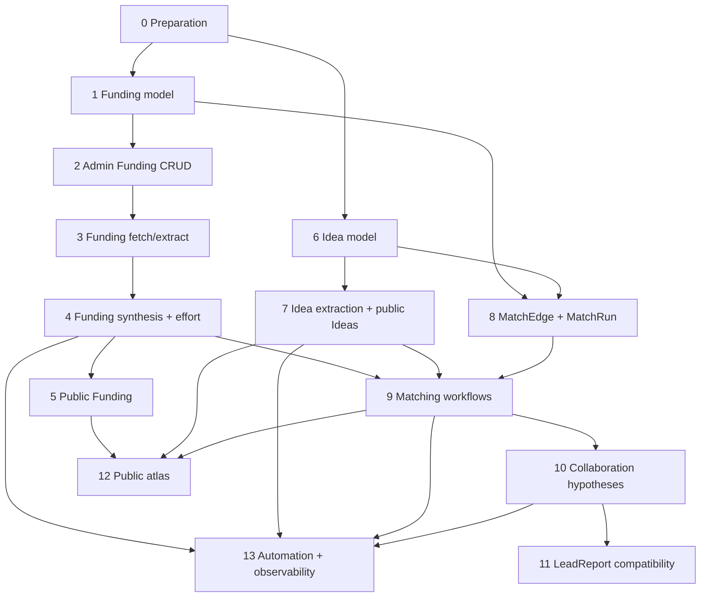

# Implementation Sequence: Synapse Funding, Ideas, Matching, and Public Discovery

## Purpose

This document defines the safest build order for extending Synapse from a persona-driven research intelligence app into a broader opportunity graph for the Neurotech Hub.

It translates the roadmap and specs into an implementation sequence that agents can follow without building dependent features before their foundations exist.

This is not a full product spec. It is the execution spine.

## Related documents

| Document | Role |
|---|---|
| `roadmap_public_site_leads_funding.md` | Overall product vision and phases |
| `funding_model.md` | Funding data model, synthesis workflow, and UI expectations |
| `effort_index.md` | Effort labels, effort score, heuristics, prompt behavior |
| `idea_model.md` | Idea entity, public/private boundaries, extraction workflow |
| `matching_and_leads.md` | MatchEdge, MatchRun, CollaborationHypothesis, scoring |
| `public_site_ux.md` | Public research atlas, funding radar, ideas, entity pages |
| `prompt_specs.md` | Prompt registry, provider routing, output schemas |
| `agent_tasks.md` | Agent work packets and acceptance criteria |

## Existing baseline to preserve

Synapse already has:

- Flask public and admin surfaces.
- SQLAlchemy models and Flask-Migrate/Alembic migrations.
- RSS and HTML ingestion into `ContentItem` rows.
- Source approval and attachment to people or organizations.
- Persona snapshots for people, organizations, and places/buildings.
- Hub-oriented lead reports.
- Public latest curation.
- Ollama/OpenAI provider routing patterns.
- Prompt templates under `prompts/`.
- Optional MCP read-only retrieval.

Do not replace these systems. Extend them.

## Implementation principles

### 1. Build reviewable data before automation

Manual admin workflows should come before automatic matching or public display. Each new generated object should be reviewable before it influences public pages or lead prioritization.

### 2. Use lightweight universal metadata

Funding sources vary widely. Avoid NIH/NSF-specific schema decisions unless the fields are clearly useful across sponsors.

### 3. Keep raw, extracted, synthesized, and reviewed data separate

For funding and future web-derived objects:

```text
raw source text
  -> extracted candidate fields
  -> synthesized JSON
  -> reviewed canonical fields
  -> public presentation
```

### 4. Keep effort separate from value

Heavy effort does not mean low value. A large center grant may be strategically important even if it is expensive to pursue.

### 5. Separate public discovery from private lead logic

The public site should help people explore. It should not expose internal scores, inferred pain points, private rationales, or outreach strategy.

### 6. Default to Ollama for broad synthesis

Use Ollama for routine extraction, tagging, effort classification, and drafts. Use OpenAI selectively for high-value, ambiguous, malformed, or final synthesis tasks.

### 7. Each milestone should be shippable

Each milestone should leave the app in a usable state. Avoid long-running branches that only work after many later components are implemented.

---

# Build overview

Recommended sequence:

```text
0. Preparation and repo alignment
1. FundingOpportunity model and migration
2. Admin Funding CRUD
3. Funding URL fetch and text extraction
4. Funding synthesis and effort classification
5. Public Funding pages and Funding Radar MVP
6. Idea model and manual admin workflow
7. Idea extraction and public Idea pages
8. MatchEdge and MatchRun foundation
9. Funding/Idea/entity matching workflows
10. CollaborationHypothesis model and admin workflow
11. LeadReport compatibility and migration path
12. Public research atlas expansion
13. Automation, refresh, observability, and cost controls
```

---

# Milestone 0 — Preparation and repo alignment

## Goal

Prepare the repository so multiple agents can work without conflicting over naming, package layout, or provider conventions.

## Dependencies

None.

## Work items

### 0.1 Add roadmap docs to `docs/`

Place the planning documents in the repository:

```text
docs/roadmap_public_site_leads_funding.md
docs/funding_model.md
docs/effort_index.md
docs/idea_model.md
docs/matching_and_leads.md
docs/public_site_ux.md
docs/prompt_specs.md
docs/agent_tasks.md
docs/implementation_sequence.md
```

### 0.2 Confirm package naming

Recommended packages:

```text
app/funding/
app/ideas/
app/matching/
app/opportunities/
```

Use `app/opportunities/` only if collaboration hypotheses feel too broad for `app/leads/`.

### 0.3 Confirm prompt naming

Recommended prompt files:

```text
prompts/funding_extract.txt
prompts/funding_effort_classify.txt
prompts/funding_public_card.txt
prompts/idea_extract_from_persona.txt
prompts/idea_public_page.txt
prompts/match_funding_to_entity.txt
prompts/match_idea_to_entity.txt
prompts/match_hub_to_target.txt
prompts/collaboration_hypothesis.txt
prompts/outreach_angle.txt
```

### 0.4 Create feature flags

Suggested environment variables:

```text
SYNAPSE_FUNDING_ENABLED=1
SYNAPSE_IDEAS_ENABLED=1
SYNAPSE_MATCHING_ENABLED=1
SYNAPSE_PUBLIC_ATLAS_ENABLED=1
SYNAPSE_COLLAB_HYPOTHESES_ENABLED=1
```

Default new features to enabled in local development and disabled or admin-only in production until reviewed.

## Acceptance criteria

- Docs are in the repo.
- Package names are agreed.
- Prompt names are agreed.
- Feature flags exist or are documented.
- No database schema changes yet.

## Test gate

```bash
pytest
```

## Rollback

Remove docs/feature flags only. No schema rollback needed.

---

# Milestone 1 — FundingOpportunity model and migration

## Goal

Add funding as a first-class entity without LLM synthesis or public UI yet.

## Dependencies

Milestone 0.

## Primary agent

Agent A — Funding Models and Migrations.

## Likely files touched

```text
app/models.py
app/funding/__init__.py
app/funding/models.py       # if models are split by package
migrations/versions/*.py
tests/test_funding_model.py
```

## Data model

Recommended canonical fields:

```text
id
slug
title
sponsor_name
source_url
source_type
status
is_public
is_reviewed
reviewed_at
reviewed_by nullable

deadline_date nullable
deadline_text nullable
amount_min nullable
amount_max nullable
amount_text nullable

effort_index
effort_score
effort_rationale

default_summary
summary_public
summary_private
eligibility_summary

topic_tags_json
method_tags_json
hub_relevance_tags_json

raw_text
raw_text_hash
synthesized_json
synthesis_status
synthesis_provider
synthesis_model
synthesis_fingerprint
synthesis_generated_at
synthesis_error

created_at
updated_at
archived_at nullable
```

Keep JSON fields flexible. Do not create separate tables for sponsors, mechanisms, tags, eligibility types, or deadlines yet.

## Field defaults

```text
status = draft
source_type = manual
effort_index = unknown
effort_score = 0.5
is_public = false
is_reviewed = false
synthesis_status = not_started
```

## Enum-like values

Use code-level validators or constants for:

```text
status: draft | active | expired | archived
source_type: manual | fetched_url | public_search | rss | imported
effort_index: mild | moderate | heavy | unknown
synthesis_status: not_started | fetched | synthesized | failed | needs_review
```

## Implementation steps

1. Add model.
2. Add migration.
3. Add indexes.
4. Add simple serializer/helper.
5. Add unit tests.
6. Run migration locally.

## Recommended indexes

```text
slug unique
source_url indexed, nullable unique preferred if normalized
status indexed
is_public indexed
is_reviewed indexed
deadline_date indexed
effort_index indexed
raw_text_hash indexed
```

## Acceptance criteria

- Funding opportunities can be created in tests.
- Slugs are generated or accepted.
- Enum-like values are validated.
- Nullable fields allow sparse records.
- Migration upgrades cleanly.
- Migration downgrades cleanly if the repo convention supports downgrade.

## Test gate

```bash
pytest tests/test_funding_model.py
flask --app wsgi db upgrade
pytest
```

## Rollback

Alembic downgrade removes the funding table. No other feature depends on it yet.

## Do not implement yet

- URL fetching.
- LLM synthesis.
- Matching.
- Public pages.

---

# Milestone 2 — Admin Funding CRUD

## Goal

Allow an operator to create, edit, review, archive, and delete/dismiss funding opportunities manually.

## Dependencies

Milestone 1.

## Primary agent

Agent D — Admin Funding UX.

## Likely files touched

```text
app/web/admin/routes.py
app/web/admin/forms.py
app/templates/admin/funding/index.html
app/templates/admin/funding/detail.html
app/templates/admin/funding/form.html
app/funding/service.py
tests/test_admin_funding_routes.py
```

## Admin routes

Suggested routes:

```text
/admin/funding/
/admin/funding/new
/admin/funding/<int:funding_id>
/admin/funding/<int:funding_id>/edit
/admin/funding/<int:funding_id>/archive
/admin/funding/<int:funding_id>/review
```

## List view

Show:

```text
title
sponsor
status
deadline
effort index
review status
public/private
synthesis status
updated_at
```

Filters:

```text
status
reviewed/unreviewed
public/private
effort index
deadline upcoming/expired
synthesis status
```

## Detail view

Show editable sections:

```text
Core fields
Deadline and amount
Effort index
Summaries
Tags
Raw text preview
Synthesis metadata
Review/publication controls
```

## Manual creation form

Minimum required fields:

```text
title
source_url optional but strongly encouraged
sponsor_name optional
status
```

## Review behavior

A funding opportunity should not be public until:

```text
is_reviewed = true
is_public = true
status in active | draft   # draft may be public if intentionally used for upcoming calls
```

## Acceptance criteria

- Admin can create a funding opportunity with only title and URL.
- Admin can edit all canonical fields.
- Admin can mark reviewed.
- Admin can toggle public/private.
- Admin can archive.
- Funding list is filterable enough to review active work.
- No LLM dependency exists in this milestone.

## Test gate

```bash
pytest tests/test_admin_funding_routes.py
pytest
```

## Rollback

Remove routes/templates. Keep schema.

## Do not implement yet

- URL fetch button.
- Synthesis button.
- Public funding pages.

---

# Milestone 3 — Funding URL fetch and text extraction

## Goal

Let an operator paste a funding URL, fetch the page, extract readable text, and store raw text with a content hash.

## Dependencies

Milestone 2.

## Primary agent

Agent B — Funding Ingestion and Text Extraction.

## Likely files touched

```text
app/funding/fetch.py
app/funding/extract.py
app/funding/service.py
app/web/admin/routes.py
app/templates/admin/funding/detail.html
tests/test_funding_fetch.py
tests/test_funding_extract.py
```

## Admin action

Add button:

```text
Fetch source text
```

Optional secondary button:

```text
Fetch again
```

## Fetch behavior

- Use conservative timeout.
- Respect redirects.
- Store final URL if different.
- Store HTTP status or fetch error.
- Do not execute JavaScript.
- Do not scrape aggressively.
- Do not recursively crawl.
- Store text only from the provided page.

## Extraction behavior

Try, in order:

1. HTML `<main>`, `<article>`, or obvious content region.
2. Title, headings, paragraphs, list items, tables.
3. Meta description if content is sparse.
4. Plain text fallback.

## Stored metadata

Add or populate:

```text
raw_text
raw_text_hash
source_url_final optional
fetch_status
fetch_error
fetched_at
```

If these fields were not added in Milestone 1, add a migration now.

## Text limits

Suggested caps:

```text
raw_text stored cap: 200,000 characters
prompt text cap later: 12,000-25,000 characters
preview cap: 4,000 characters
```

## Security constraints

- Strip scripts/styles.
- Do not allow file URLs.
- Block localhost/private network URLs unless explicitly in debug/dev mode.
- Avoid storing credentials or cookies.

## Acceptance criteria

- Admin can fetch source text from a normal HTML page.
- Raw text is stored.
- Raw text hash changes when content changes.
- Fetch errors are visible but do not crash the admin page.
- Tests cover successful fetch, timeout/error, empty page, and HTML cleanup.

## Test gate

```bash
pytest tests/test_funding_fetch.py tests/test_funding_extract.py
pytest
```

## Rollback

Remove fetch action and service. Existing funding records remain valid.

## Do not implement yet

- LLM extraction.
- Public display of fetched text.
- Automated scraping.

---

# Milestone 4 — Funding synthesis and effort classification

## Goal

Convert raw funding text into lightweight structured metadata, including effort index.

## Dependencies

Milestone 3.

## Primary agents

Agent C — Funding Synthesis and Effort Index.

Agent F — Prompt/provider infrastructure if shared prompt utilities are needed.

## Likely files touched

```text
app/funding/synthesis.py
app/funding/effort.py
app/funding/service.py
app/ingest/llm_client.py       # only if provider routing needs extension
prompts/funding_extract.txt
prompts/funding_effort_classify.txt
tests/test_funding_synthesis.py
tests/test_effort_index.py
```

## Admin actions

Add buttons:

```text
Synthesize from raw text
Fetch and synthesize
Re-synthesize
```

## Recommended two-step synthesis

### Step 1: deterministic pre-classifier

Use simple rules to estimate:

```text
amount range
deadline text
effort index guess
obvious tags
```

### Step 2: LLM synthesis

Use local Ollama by default to produce structured JSON.

### Step 3: validation and merge

Validate the JSON and merge into canonical fields only when safe.

## Output schema

```json
{
  "title": "",
  "sponsor": "",
  "one_sentence_summary": "",
  "public_summary": "",
  "private_summary": "",
  "who_should_care": [],
  "eligible_entities": [],
  "topic_tags": [],
  "method_tags": [],
  "hub_relevance_tags": [],
  "amount_text": "",
  "amount_min": null,
  "amount_max": null,
  "deadline_text": "",
  "deadline_date": null,
  "effort_index": "mild|moderate|heavy|unknown",
  "effort_score": 0.5,
  "effort_rationale": "",
  "confidence": 0.0,
  "missing_information": [],
  "review_flags": []
}
```

## Provider routing

Suggested defaults:

```text
SYNAPSE_LLM_FUNDING_PROVIDER=ollama
SYNAPSE_LLM_FUNDING_FALLBACK_OPENAI=0
SYNAPSE_OPENAI_FUNDING_MODEL=<configured model>
SYNAPSE_FUNDING_PROMPT_CHARS=18000
```

Escalate to OpenAI when:

- The admin explicitly clicks a high-quality synthesis button.
- Ollama returns malformed JSON repeatedly.
- Confidence is low and the opportunity is marked high priority.
- The page is long or complex and local synthesis is poor.

## Review behavior

LLM output should set:

```text
synthesis_status = synthesized | failed | needs_review
is_reviewed = false
```

The admin must approve before public use.

## Acceptance criteria

- Funding record with raw text can be synthesized.
- Valid JSON is stored in `synthesized_json`.
- Canonical fields update from synthesis when empty or when admin confirms overwrite.
- Effort index appears with rationale.
- Provider/model/fingerprint metadata are stored.
- Failed synthesis leaves the record editable.

## Test gate

```bash
pytest tests/test_effort_index.py tests/test_funding_synthesis.py
pytest
```

## Rollback

Disable synthesis buttons. Existing funding rows remain usable manually.

## Do not implement yet

- Matching.
- Collaboration hypotheses.
- Public idea integration.

---

# Milestone 5 — Public Funding pages and Funding Radar MVP

## Goal

Expose reviewed funding opportunities on the public site in a simple, useful, low-risk way.

## Dependencies

Milestone 4.

## Primary agent

Agent G — Public Site UX.

## Likely files touched

```text
app/web/public_routes.py
app/templates/public/funding/index.html
app/templates/public/funding/detail.html
app/templates/public/components/funding_card.html
app/funding/public_service.py
tests/test_public_funding_routes.py
```

## Public routes

```text
/funding/
/funding/<slug>
```

## Funding index filters

```text
topic tag
method tag
effort index
sponsor
upcoming deadline
```

## Funding card fields

Show:

```text
title
sponsor
short public summary
deadline text/date
amount text
effort index
public tags
external link
```

Do not show:

```text
private_summary
internal notes
match score
lead score
outreach rationale
inferred target pain
```

## Funding detail page

Include:

```text
what this supports
who might care
topic/method tags
amount/deadline if known
external source link
review freshness
```

## Acceptance criteria

- Only reviewed and public records appear.
- Archived records do not appear.
- Expired records are hidden by default or clearly labeled.
- External links are prominent.
- Public pages work without any matching/idea data.

## Test gate

```bash
pytest tests/test_public_funding_routes.py
pytest
```

## Rollback

Disable public funding route with feature flag. Admin funding remains intact.

## Do not implement yet

- Related people/orgs/ideas unless they already exist manually.
- Public match language.

---

# Milestone 6 — Idea model and manual admin workflow

## Goal

Add Ideas as first-class connective tissue, starting with manual curation.

## Dependencies

Milestone 5 can proceed independently, but Ideas should land before sophisticated matching.

## Primary agent

Agent E — Ideas Model and Admin UX.

## Likely files touched

```text
app/ideas/__init__.py
app/ideas/models.py
app/ideas/service.py
app/models.py
app/web/admin/routes.py
app/web/admin/forms.py
app/templates/admin/ideas/index.html
app/templates/admin/ideas/detail.html
app/templates/admin/ideas/form.html
migrations/versions/*.py
tests/test_idea_model.py
tests/test_admin_ideas_routes.py
```

## Data model

Recommended fields:

```text
id
slug
title
idea_type
status
is_public
is_reviewed
short_description
public_summary
private_notes
tags_json
hub_capabilities_json
evidence_json
created_at
updated_at
reviewed_at
archived_at nullable
```

Optional lightweight join table:

```text
IdeaEntityLink
  idea_id
  entity_type
  entity_id
  relationship_type
  confidence
  rationale
  is_public
  created_at
```

This join table is useful before full `MatchEdge` exists.

## Admin routes

```text
/admin/ideas/
/admin/ideas/new
/admin/ideas/<int:idea_id>
/admin/ideas/<int:idea_id>/edit
/admin/ideas/<int:idea_id>/archive
/admin/ideas/<int:idea_id>/review
```

## Idea types

```text
research_theme
technical_capability
buildable_concept
method_cluster
funding_theme
strategic_area
public_resource_topic
```

## Acceptance criteria

- Admin can create and edit Ideas manually.
- Ideas can be reviewed and marked public.
- Ideas can store tags and Hub capabilities.
- Optional links to people/orgs/places/funding can be added manually if implemented.
- Public pages are not required yet.

## Test gate

```bash
pytest tests/test_idea_model.py tests/test_admin_ideas_routes.py
pytest
```

## Rollback

Alembic downgrade removes Idea tables. Disable routes.

## Do not implement yet

- LLM idea extraction.
- MatchEdge.
- Collaboration hypotheses.

---

# Milestone 7 — Idea extraction and public Idea pages

## Goal

Use personas/content to suggest Ideas and expose reviewed Ideas publicly.

## Dependencies

Milestone 6.

## Primary agents

Agent F — Idea Extraction from Personas and Content.

Agent G — Public Site UX.

## Likely files touched

```text
app/ideas/extract.py
app/ideas/dedupe.py
app/ideas/public_service.py
app/web/admin/routes.py
app/web/public_routes.py
app/templates/public/ideas/index.html
app/templates/public/ideas/detail.html
app/templates/public/components/idea_card.html
prompts/idea_extract_from_persona.txt
prompts/idea_public_page.txt
tests/test_idea_extract.py
tests/test_public_ideas_routes.py
```

## Admin actions

```text
Suggest ideas from persona
Suggest ideas from content item
Suggest related ideas
Merge duplicate ideas
Generate public summary
```

## Public routes

```text
/ideas/
/ideas/<slug>
```

## Public Idea detail sections

```text
Overview
Why it matters
Related methods
Related funding if manually linked or matched later
Related people/orgs/places if public links exist
How the Hub can help
Latest related content
```

## Provider routing

Use Ollama for:

```text
idea suggestions
tagging
duplicate candidates
first-pass summaries
```

Use OpenAI for:

```text
public polished pages
complex duplicate/merge decisions
high-value strategic idea synthesis
```

## Acceptance criteria

- Admin can generate idea suggestions from a persona or content item.
- Suggestions are draft/unreviewed by default.
- Duplicate detection prevents obvious repeated ideas.
- Reviewed public Ideas appear at `/ideas/`.
- Public Idea detail pages do not expose private lead logic.

## Test gate

```bash
pytest tests/test_idea_extract.py tests/test_public_ideas_routes.py
pytest
```

## Rollback

Disable extraction actions and public route. Manual Ideas remain intact.

## Do not implement yet

- Automatic matching.
- Collaboration hypotheses.

---

# Milestone 8 — MatchEdge and MatchRun foundation

## Goal

Create the generic matching infrastructure before adding specific match workflows.

## Dependencies

Milestones 1 and 6.

## Primary agent

Agent G — Matching Engine.

## Likely files touched

```text
app/matching/__init__.py
app/matching/models.py
app/matching/service.py
app/models.py
migrations/versions/*.py
tests/test_match_models.py
```

## Data model: MatchEdge

Recommended fields:

```text
id
source_type
source_id
target_type
target_id
match_type
score
confidence
status
visibility
rationale
public_rationale
private_rationale
evidence_json
score_breakdown_json
provider
model
prompt_version
fingerprint
created_at
updated_at
reviewed_at
archived_at nullable
```

## Data model: MatchRun

Recommended fields:

```text
id
run_type
status
source_type nullable
source_id nullable
provider
model
prompt_version
input_fingerprint
candidate_count
created_count
updated_count
error_count
error_summary
started_at
finished_at
created_at
```

## Entity type constants

```text
person
organization
place
building
funding
idea
hub
content_item
```

## Match type constants

```text
funding_to_idea
funding_to_person
funding_to_organization
idea_to_person
idea_to_organization
idea_to_place
hub_to_person
hub_to_organization
hub_to_funding
```

## Status constants

```text
draft
needs_review
accepted
rejected
archived
stale
```

## Visibility constants

```text
private
public_safe
public
```

## Acceptance criteria

- MatchEdge can store a score and rationale between any supported entity types.
- MatchRun tracks batch matching jobs.
- No matching algorithm is required yet.
- Indexes support querying by source, target, match type, and status.

## Test gate

```bash
pytest tests/test_match_models.py
pytest
```

## Rollback

Alembic downgrade removes MatchEdge/MatchRun. No public route depends on it yet.

## Do not implement yet

- Candidate generation.
- LLM match scoring.
- Collaboration hypotheses.

---

# Milestone 9 — Funding/Idea/entity matching workflows

## Goal

Generate explainable matches between funding, ideas, people, organizations, places, and Hub capabilities.

## Dependencies

Milestones 4, 7, and 8.

## Primary agent

Agent G — Matching Engine.

## Supporting agent

Agent F — Prompt/provider infrastructure.

## Likely files touched

```text
app/matching/candidates.py
app/matching/scoring.py
app/matching/prompts.py
app/matching/service.py
app/web/admin/routes.py
app/templates/admin/matching/dashboard.html
app/templates/admin/components/match_card.html
prompts/match_funding_to_entity.txt
prompts/match_idea_to_entity.txt
prompts/match_hub_to_target.txt
tests/test_matching_candidates.py
tests/test_matching_scoring.py
tests/test_admin_matching_routes.py
```

## Workflows

### Generate matches for one funding opportunity

Input:

```text
FundingOpportunity
candidate Ideas
candidate People
candidate Organizations
optional Places
Hub capability profile
```

Output:

```text
MatchEdge records:
  funding_to_idea
  funding_to_person
  funding_to_organization
  hub_to_funding
```

### Generate matches for one Idea

Input:

```text
Idea
personas
organization rollups
places/buildings
funding opportunities
```

Output:

```text
MatchEdge records:
  idea_to_person
  idea_to_organization
  idea_to_place
  funding_to_idea
```

### Generate Hub-target matches

Input:

```text
Hub corpus/persona
person/org/place persona
optional related Ideas
optional related Funding
```

Output:

```text
MatchEdge records:
  hub_to_person
  hub_to_organization
```

## Candidate generation first, LLM second

Do not call the LLM across every possible pair.

Candidate generation should use:

```text
tag overlap
keyword overlap
persona focus/method fields
recent content tags
funding topic/method tags
manual links
Hub capability tags
```

Then LLM scoring should evaluate only plausible candidates.

## Scoring outputs

Each match should have:

```text
score 0.0-1.0
confidence 0.0-1.0
score_breakdown_json
rationale
public_rationale if safe
private_rationale if needed
supporting evidence references
```

## Provider routing

Use Ollama for:

```text
broad match scoring
low-stakes rationale drafts
candidate tag refinement
```

Use OpenAI for:

```text
top matches
uncertain matches
strategic Hub-target matches
public-safe rationales if shown publicly
```

## Admin UX

Add:

```text
/admin/matching/
```

Show:

```text
recent match runs
high-scoring unreviewed matches
failed runs
stale matches
filters by match type/entity/status
```

On entity detail pages show:

```text
Related ideas
Related funding
Related people/orgs/places
Hub fit
```

Private by default.

## Acceptance criteria

- Admin can generate matches for one funding opportunity.
- Admin can generate matches for one Idea.
- MatchEdges are saved with scores and rationales.
- Matches are private/needs_review by default.
- Admin can accept/reject/archive a match.
- Public pages do not automatically show private matches.

## Test gate

```bash
pytest tests/test_matching_candidates.py tests/test_matching_scoring.py tests/test_admin_matching_routes.py
pytest
```

## Rollback

Disable matching routes/actions. MatchEdge table can remain.

## Do not implement yet

- Collaboration hypotheses.
- Outreach angle generation.
- Automated scheduled matching.

---

# Milestone 10 — CollaborationHypothesis model and admin workflow

## Goal

Turn reviewed matches into actionable, evidence-backed collaboration hypotheses.

## Dependencies

Milestone 9.

## Primary agent

Agent H — Collaboration Hypotheses.

## Likely files touched

```text
app/opportunities/__init__.py
app/opportunities/models.py
app/opportunities/service.py
app/opportunities/scoring.py
app/web/admin/routes.py
app/templates/admin/opportunities/index.html
app/templates/admin/opportunities/detail.html
app/templates/admin/components/collaboration_hypothesis_card.html
prompts/collaboration_hypothesis.txt
prompts/outreach_angle.txt
migrations/versions/*.py
tests/test_collaboration_hypothesis_model.py
tests/test_collaboration_hypothesis_generation.py
tests/test_admin_opportunities_routes.py
```

Alternative: place this under `app/leads/` if you prefer to evolve the existing lead system directly.

## Data model

Recommended fields:

```text
id
title
status
priority

target_type
target_id
idea_id nullable
funding_id nullable
primary_match_id nullable
related_match_ids_json

hypothesis_summary
evidence_summary
hub_fit_summary
funding_fit_summary
effort_summary
recommended_action
outreach_angle

score_fit
score_timing
score_funding
score_effort
score_relationship
score_strategic
score_total
score_breakdown_json

public_safe_summary nullable
private_notes
provider
model
prompt_version
fingerprint
created_at
updated_at
reviewed_at
contacted_at nullable
archived_at nullable
```

## Status values

```text
draft
needs_review
reviewed
active
contacted
dismissed
archived
stale
```

## Priority values

```text
low
medium
high
strategic
```

## Generation workflow

1. Select target entity.
2. Gather accepted or high-score matches.
3. Gather target persona summary.
4. Gather Hub corpus/persona summary.
5. Gather related Ideas.
6. Gather related Funding.
7. Generate hypothesis draft.
8. Store as private/unreviewed.
9. Admin edits/reviews.

## Recommended action types

```text
send_intro
invite_to_meeting
suggest_pilot
share_resource
watch_only
funding_conversation
internal_strategy_only
```

## Important scoring rule

Do not let effort dominate total score.

Store effort as:

```text
score_effort
funding_effort_index
funding_effort_rationale
```

But keep:

```text
score_funding
score_strategic
score_relationship
```

separate.

## Acceptance criteria

- Admin can generate a collaboration hypothesis from a target and related matches.
- Hypothesis stores score breakdown and recommended action.
- Hypothesis is private by default.
- Admin can edit status and priority.
- Admin can dismiss or archive.
- No outbound email is sent.

## Test gate

```bash
pytest tests/test_collaboration_hypothesis_model.py tests/test_collaboration_hypothesis_generation.py tests/test_admin_opportunities_routes.py
pytest
```

## Rollback

Disable opportunity routes/actions. Matching remains intact.

## Do not implement yet

- Automatic outreach.
- Email sending.
- Public display of collaboration hypotheses.

---

# Milestone 11 — LeadReport compatibility and migration path

## Goal

Preserve the existing LeadReport workflow while gradually moving toward structured collaboration hypotheses.

## Dependencies

Milestone 10.

## Primary agent

Agent H or an integration agent familiar with existing `app/leads/`.

## Likely files touched

```text
app/leads/
app/opportunities/service.py
app/web/admin/routes.py
app/templates/admin/leads/*.html
app/templates/admin/opportunities/*.html
tests/test_lead_report_compatibility.py
```

## Compatibility strategy

### Step 1: Do nothing destructive

Keep existing LeadReport jobs working.

### Step 2: Link LeadReports to CollaborationHypotheses

Add nullable field if needed:

```text
lead_report_id nullable
```

or add a small join table if many-to-many is useful.

### Step 3: Add “Create hypothesis from report”

Admin action:

```text
Create Collaboration Hypothesis from Lead Report
```

This parses/summarizes the report into the new structured form.

### Step 4: Add “Generate report from hypothesis” later if useful

This would let a structured hypothesis produce a longer narrative report.

### Step 5: Decide long-term naming

Options:

```text
Keep LeadReport as long-form artifact
Use CollaborationHypothesis as primary actionable object
Use MatchEdge as lower-level relationship evidence
```

## Acceptance criteria

- Existing LeadReport tests still pass.
- Existing admin lead reports remain usable.
- A hypothesis can be created from a LeadReport without deleting the original.
- The UI explains the difference between a report and a hypothesis.

## Test gate

```bash
pytest tests/test_lead_report_compatibility.py
pytest
```

## Rollback

Remove linking/conversion action. Existing LeadReports remain unaffected.

---

# Milestone 12 — Public research atlas expansion

## Goal

Turn the public site into a fun, resourceful, exploratory research atlas using reviewed public data.

## Dependencies

Milestones 5, 7, and optionally 9.

## Primary agent

Agent G — Public Site UX.

## Likely files touched

```text
app/web/public_routes.py
app/public_atlas/
app/templates/public/index.html
app/templates/public/explore.html
app/templates/public/people/*.html
app/templates/public/organizations/*.html
app/templates/public/places/*.html
app/templates/public/ideas/*.html
app/templates/public/funding/*.html
app/templates/public/components/*.html
static/css/*.css
static/js/*.js
tests/test_public_atlas_routes.py
```

## Public navigation

```text
Home
Explore
People
Organizations
Places
Ideas
Funding
Latest
Submit
Request Hub Support
```

## Explore page

A cross-entity discovery page with cards for:

```text
People
Organizations
Places
Ideas
Funding
Latest content
```

## Public entity page enhancements

### People

Add public-safe related:

```text
Ideas
Organizations
Funding, if public-safe and reviewed
Latest content
```

### Organizations

Add:

```text
Affiliated people
Ideas
Places/buildings
Funding, if public-safe and reviewed
```

### Places

Add:

```text
Organizations in/near this place
People connected to this place
Ideas concentrated here
```

### Ideas

Add:

```text
Related people
Related organizations
Related places
Related funding
How the Hub can help
```

### Funding

Add:

```text
Related Ideas
possibly related public topics
external link
```

Avoid showing direct “this person should apply” language unless reviewed and phrased generally.

## UI concepts

```text
Funding Radar
Idea Constellations
Buildable Ideas
Research Atlas Map
Latest Signals
```

## Public/private safety gate

Only show relationships where:

```text
match.visibility in public | public_safe
match.status in accepted | reviewed
related entity is public/reviewed
```

## Acceptance criteria

- Public site can be navigated by entity type.
- Public pages show reviewed Ideas and Funding.
- Related entity chips/cards are public-safe.
- Private match/lead logic is not exposed.
- The site is useful even if matching is disabled.

## Test gate

```bash
pytest tests/test_public_atlas_routes.py
pytest
```

## Rollback

Disable public atlas feature flag. Original public routes remain.

---

# Milestone 13 — Automation, refresh, observability, and cost controls

## Goal

Make the system sustainable at scale without uncontrolled scraping or model spending.

## Dependencies

All prior milestones, but pieces can be added earlier if needed.

## Primary agents

Agent F — Prompt/provider infrastructure.

Agent I — Automation and Observability, if assigned.

## Likely files touched

```text
app/jobs/
app/funding/service.py
app/ideas/service.py
app/matching/service.py
app/opportunities/service.py
app/ingest/llm_client.py
app/observability/
app/web/admin/routes.py
app/templates/admin/system/*.html
migrations/versions/*.py
tests/test_job_runs.py
tests/test_provider_cost_logging.py
```

## Suggested shared model: JobRun

```text
id
job_type
status
entity_type nullable
entity_id nullable
provider nullable
model nullable
input_fingerprint nullable
started_at
finished_at
duration_ms
result_summary
error_summary
metadata_json
created_at
```

## Suggested shared model: LLMCallLog

```text
id
provider
model
prompt_name
prompt_version
input_chars
output_chars
estimated_tokens
estimated_cost nullable
status
latency_ms
error_summary
entity_type nullable
entity_id nullable
created_at
```

## Automation candidates

```text
refresh funding pages with upcoming deadlines
mark funding expired
suggest ideas from newly refreshed personas
generate match candidates for new funding
mark stale matches after entity changes
notify admin of high-signal opportunities
```

## Cost controls

- Hash prompt inputs and skip duplicate calls.
- Store prompt version and input fingerprint.
- Use deterministic candidate generation before LLM scoring.
- Batch cheap tasks through Ollama.
- Require explicit admin action for OpenAI escalation.
- Cap daily/weekly OpenAI calls if needed.

## Acceptance criteria

- Admin can see recent job runs.
- Admin can see failed jobs.
- LLM calls are logged with provider/model/prompt.
- Repeated unchanged synthesis does not call the model unnecessarily.
- Expired funding is detected.
- Automation can be disabled by feature flag.

## Test gate

```bash
pytest tests/test_job_runs.py tests/test_provider_cost_logging.py
pytest
```

## Rollback

Disable scheduled jobs and feature flags. Core manual workflows remain usable.

---

# Cross-milestone dependency map



---

# Recommended branch strategy

## Small branches

Prefer small branches by milestone:

```text
feature/funding-model
feature/admin-funding-crud
feature/funding-fetch
feature/funding-synthesis-effort
feature/public-funding
feature/ideas-model
feature/idea-extraction-public
feature/matching-foundation
feature/matching-workflows
feature/collaboration-hypotheses
feature/leadreport-compat
feature/public-atlas
feature/automation-observability
```

## Merge rules

A branch should merge only when:

- It has a migration, if schema changed.
- It has tests for new behavior.
- It does not break existing persona/lead/public flows.
- It is feature-flagged if public-facing or experimental.
- It does not require later branches to keep the app running.

---

# Suggested implementation order by agent

## Agent A — Data foundations

1. Milestone 1: FundingOpportunity model.
2. Milestone 6: Idea model.
3. Milestone 8: MatchEdge/MatchRun.
4. Milestone 10: CollaborationHypothesis.
5. Milestone 13: JobRun/LLMCallLog if needed.

## Agent B — Funding ingestion

1. Milestone 3: URL fetch and extraction.
2. Milestone 4: synthesis integration support.
3. Milestone 13: refresh/staleness jobs.

## Agent C — Effort and synthesis

1. Milestone 4: deterministic effort classifier.
2. Milestone 4: LLM funding synthesis.
3. Milestone 9: effort-aware funding matching.
4. Milestone 13: provider/cost logging.

## Agent D — Admin UX

1. Milestone 2: Funding CRUD.
2. Milestone 4: synthesis review UI.
3. Milestone 6: Ideas admin.
4. Milestone 9: matching admin.
5. Milestone 10: opportunities admin.

## Agent E — Ideas

1. Milestone 6: Ideas model/admin.
2. Milestone 7: idea extraction.
3. Milestone 7: public Idea pages.
4. Milestone 9: idea matching.

## Agent F — Prompt/provider infrastructure

1. Milestone 4: funding prompts.
2. Milestone 7: idea prompts.
3. Milestone 9: matching prompts.
4. Milestone 10: collaboration hypothesis prompts.
5. Milestone 13: logging/cost controls.

## Agent G — Public UX

1. Milestone 5: Funding Radar MVP.
2. Milestone 7: Ideas public pages.
3. Milestone 12: public research atlas.
4. Milestone 12: related entity chips/cards.

## Agent H — Lead/opportunity logic

1. Milestone 10: CollaborationHypothesis.
2. Milestone 11: LeadReport compatibility.
3. Milestone 13: opportunity refresh/staleness.

---

# Test strategy by layer

## Model tests

Run after every schema milestone:

```bash
pytest tests/test_funding_model.py
pytest tests/test_idea_model.py
pytest tests/test_match_models.py
pytest tests/test_collaboration_hypothesis_model.py
```

## Route tests

Run after every admin/public route milestone:

```bash
pytest tests/test_admin_funding_routes.py
pytest tests/test_public_funding_routes.py
pytest tests/test_admin_ideas_routes.py
pytest tests/test_public_ideas_routes.py
pytest tests/test_admin_matching_routes.py
pytest tests/test_admin_opportunities_routes.py
pytest tests/test_public_atlas_routes.py
```

## Prompt tests

Prompt tests should not depend on live OpenAI/Ollama by default. Use fixtures or mocked providers.

```bash
pytest tests/test_funding_synthesis.py
pytest tests/test_effort_index.py
pytest tests/test_idea_extract.py
pytest tests/test_matching_scoring.py
pytest tests/test_collaboration_hypothesis_generation.py
```

## Integration tests

Use optional markers for live Ollama or OpenAI only.

```bash
pytest -m "not ollama"
pytest -m ollama
```

## Full gate

Before merging each milestone:

```bash
flask --app wsgi db upgrade
pytest
```

---

# Data migration checkpoints

## Checkpoint 1

After Milestone 1:

```text
FundingOpportunity table exists.
No other new tables depend on it.
```

## Checkpoint 2

After Milestone 6:

```text
Idea table exists.
Optional IdeaEntityLink table exists.
Funding and Idea can both exist without matching.
```

## Checkpoint 3

After Milestone 8:

```text
MatchEdge and MatchRun exist.
No rows required.
No public behavior changes by default.
```

## Checkpoint 4

After Milestone 10:

```text
CollaborationHypothesis exists.
Private/admin only.
Existing LeadReport remains intact.
```

## Checkpoint 5

After Milestone 13:

```text
JobRun and/or LLMCallLog exist.
Automation is feature-flagged.
```

---

# Rollback policy

## Safe rollback order

If a later milestone causes trouble, disable in this order:

```text
1. Public atlas routes
2. Collaboration hypothesis generation
3. Matching generation actions
4. Idea extraction actions
5. Funding synthesis actions
6. Funding fetch actions
7. Public funding pages
8. Admin CRUD only as a last resort
```

## Feature flags should control

```text
public visibility
admin actions
LLM calls
automatic jobs
OpenAI escalation
```

## Database rollbacks

Avoid rolling back schema in production if rows exist unless necessary. Prefer hiding routes/actions and leaving data in place.

---

# Public/private safety checklist

Before any public route shows new data, confirm:

```text
Entity is reviewed.
Entity is public.
Entity is not archived.
Relationship is reviewed or accepted.
Relationship visibility is public or public_safe.
Text does not include private notes, scores, inferred pain, or outreach strategy.
External funding source link is shown when possible.
```

Public funding pages may show effort index. They should not show internal effort score calculations unless intentionally simplified.

---

# Provider and cost checklist

Before any new LLM feature merges, confirm:

```text
Prompt file exists under prompts/.
Prompt name/version is recorded.
Provider/model is recorded.
Input fingerprint is recorded.
Output JSON is validated.
Malformed JSON has a repair/fail path.
Ollama is default for broad tasks.
OpenAI escalation is explicit or feature-flagged.
Repeated unchanged inputs do not call the model again.
```

---

# UI acceptance checklist

## Admin UI

Every generated object should show:

```text
status
review state
provider/model if generated
last generated time
raw/synthesized/reviewed distinction
accept/reject/archive controls where relevant
```

## Public UI

Every public exploratory page should show:

```text
clear title
short summary
tags/chips
related public entities when reviewed
external source links when relevant
no private lead rationale
```

---

# Minimal viable release path

If time is limited, ship this reduced sequence:

```text
1. FundingOpportunity model
2. Admin Funding CRUD
3. Funding fetch/extract
4. Funding synthesis + effort index
5. Public Funding Radar
6. Idea model
7. Public Idea pages
```

This release gives immediate public value without building the full matching engine.

Then follow with:

```text
8. MatchEdge
9. Funding-to-Idea matching
10. CollaborationHypothesis
```

---

# First two-week sprint recommendation

## Sprint objective

Ship a useful Funding MVP with admin review and no risky automation.

## Included

```text
Milestone 1: FundingOpportunity model
Milestone 2: Admin Funding CRUD
Milestone 3: Funding URL fetch/extract
Partial Milestone 4: deterministic effort classifier only
```

## Not included

```text
LLM synthesis
public pages
matching
ideas
collaboration hypotheses
```

## Sprint demo

Admin can:

1. Add a funding URL.
2. Fetch source text.
3. See extracted title/body preview.
4. Manually edit summary/deadline/amount.
5. See a deterministic effort guess.
6. Mark reviewed.

This creates real data and validates whether the lightweight metadata model is sufficient before adding LLMs.

---

# Second sprint recommendation

## Sprint objective

Ship synthesis and public funding discovery.

## Included

```text
Finish Milestone 4: Ollama funding synthesis + effort classifier
Milestone 5: Public Funding Radar MVP
```

## Sprint demo

Admin can:

1. Fetch and synthesize a funding URL.
2. Review/override effort index.
3. Publish the funding opportunity.

Public visitor can:

1. Browse funding opportunities.
2. Filter by topic or effort.
3. Open a detail page.
4. Follow the external source link.

---

# Third sprint recommendation

## Sprint objective

Add Ideas as the public exploratory layer.

## Included

```text
Milestone 6: Idea model/admin
Milestone 7: public Idea pages
Partial Milestone 7: manual idea summaries before LLM extraction
```

## Sprint demo

Admin can:

1. Create an Idea.
2. Link it manually to funding or entities if `IdeaEntityLink` exists.
3. Publish the Idea.

Public visitor can:

1. Browse Ideas.
2. Open an Idea page.
3. See related funding.
4. Understand how the Hub can help.

---

# Fourth sprint recommendation

## Sprint objective

Add matching without collaboration hypotheses.

## Included

```text
Milestone 8: MatchEdge/MatchRun
Milestone 9: funding-to-idea and idea-to-entity matching
```

## Sprint demo

Admin can:

1. Generate matches for a funding opportunity.
2. Review scored related Ideas/entities.
3. Accept or reject matches.
4. Optionally expose public-safe relationships.

---

# Fifth sprint recommendation

## Sprint objective

Add actionable private collaboration hypotheses.

## Included

```text
Milestone 10: CollaborationHypothesis
Milestone 11: LeadReport compatibility
```

## Sprint demo

Admin can:

1. Select a target person/org.
2. Generate a collaboration hypothesis.
3. See evidence, Hub fit, funding fit, effort, and recommended action.
4. Mark as active, contacted, dismissed, or archived.

---

# Final guidance for agents

Build in this order:

```text
data model
admin review
manual workflow
fetch/extract
synthesis
public display
matching
hypothesis generation
automation
```

Do not start with automation.

Do not start with public relationship graphs.

Do not start with full grant metadata.

The strongest early product is a reviewed Funding Radar plus Ideas layer. The strongest later product is evidence-backed collaboration hypotheses that connect people, organizations, places, ideas, Hub capabilities, and funding.
