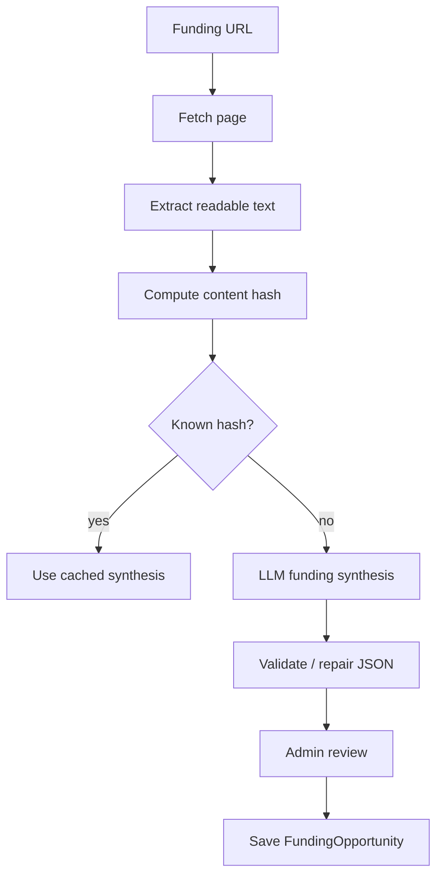

# Synapse Roadmap: Public Discovery, Funding, and Collaboration Intelligence

## Purpose

This document defines a phased roadmap for extending Synapse from a research-intelligence ingestion and persona system into a **research opportunity graph** for the Neurotech Hub.

The goal is not to build a generic CRM. The goal is to help the Hub identify, explain, and act on meaningful collaborations grounded in evidence from public research output, institutional context, geography, ideas, and funding opportunities.

Core thesis:

> Synapse should connect people, organizations, places, ideas, content evidence, Hub capabilities, and funding opportunities into collaboration hypotheses.

The public site should feel generous, exploratory, and useful. The private/admin side should help operators prioritize high-signal opportunities and make better outreach decisions.

---

## Current foundation

Synapse already has a strong foundation for this direction:

- RSS and HTML ingestion into normalized `ContentItem` rows.
- Public URL submission and admin review.
- People, organizations, buildings, and regions.
- Persona snapshots for people, organizations, and places.
- Organization and place rollups.
- A Hub-centric lead report pipeline.
- Public and admin surfaces.
- LLM provider routing across OpenAI and Ollama.
- Evidence packing, context budgeting, and prompt externalization.

This roadmap extends those existing concepts instead of replacing them.

---

## Product framing

### Synapse is a research opportunity graph

Synapse should represent relationships among:

- **People** — researchers, faculty, collaborators, clinicians, engineers, administrators.
- **Organizations** — labs, departments, centers, institutes, companies, nonprofits.
- **Places** — buildings, campuses, regions, facilities, cores, institutes.
- **Ideas** — research themes, technical opportunities, buildable concepts, methodological clusters.
- **Funding** — grants, seed mechanisms, foundation calls, internal programs, philanthropic opportunities.
- **Evidence** — publications, RSS entries, HTML snapshots, submitted URLs, curated content.
- **Hub capabilities** — technical services, platforms, prototypes, methods, devices, expertise.
- **Collaboration hypotheses** — evidence-backed possible actions for the Neurotech Hub.

### Public value proposition

The public site should feel like:

> A living map of the people, places, ideas, tools, and funding shaping neuroscience technology.

Public users should be able to explore, learn, submit links, discover funding, and understand how the Hub might help.

### Private/admin value proposition

The admin side should help operators answer:

- Who should the Hub know about?
- What are they working on?
- What technical bottleneck or opportunity might exist?
- What funding could support collaboration?
- Why now?
- What should the Hub do next?

---

## Public/private boundary

The public site should expose discovery and resources. It should not expose private lead logic.

### Public-safe

- People, organizations, places, and ideas built from public evidence.
- Funding summaries and external links.
- Related public entities.
- High-level Hub relevance.
- Public Latest cards.
- Public idea pages.
- Public funding radar.
- Public link submission.
- Request Hub support / start a conversation forms.

### Private/admin-only

- Lead scores.
- Collaboration hypotheses.
- Inferred pain points.
- Outreach strategy.
- Relationship-path notes.
- Internal strategic value.
- Operator review status.
- Rejected or hidden matches.
- Provider costs and run logs.

The public site should feel helpful, not extractive.

---

## Vocabulary

| Term | Meaning |
|---|---|
| `FundingOpportunity` | A grant, award, seed mechanism, foundation call, institutional program, or other support opportunity. |
| `EffortIndex` | A simple classification of likely application/work burden: `mild`, `moderate`, `heavy`, or `unknown`. |
| `Idea` | A research theme, technical opportunity, or buildable concept that can connect people, organizations, places, funding, and Hub capabilities. |
| `MatchEdge` | A scored relationship between two entities, with rationale and evidence. |
| `CollaborationHypothesis` | An actionable, evidence-backed possible collaboration involving the Hub, a target, and optionally an idea or funding opportunity. |
| `HubCapability` | A structured representation of what the Neurotech Hub can do. This may initially live in config or JSON. |
| `EvidenceItem` | A normalized claim or excerpt derived from content. This may be deferred until later; `ContentItem` can serve as initial evidence. |

---

## Phased roadmap

## Phase 0 — Product framing and vocabulary

### Goal

Create the shared conceptual language needed for agents to work consistently.

### Included

- Define Synapse as a research opportunity graph.
- Establish public/private boundary.
- Define `FundingOpportunity`, `Idea`, `MatchEdge`, and `CollaborationHypothesis`.
- Clarify how lead reports should evolve without breaking current functionality.
- Define scoring philosophy.
- Define provider/cost policy.

### Architecture

No required schema changes.

Optional documentation-only additions:

- `docs/roadmap_public_site_leads_funding.md`
- `docs/glossary.md`
- `docs/public_private_boundary.md`

### UI/UX

No required UI changes.

### Prompts

No production prompts yet. This phase may draft prompt specifications.

### Acceptance criteria

- Roadmap exists.
- Vocabulary is stable enough for implementation agents.
- Public/private boundary is explicit.
- Phases can be implemented independently.

---

## Phase 1 — Funding MVP

### Goal

Add manually entered funding opportunities with lightweight metadata and admin review.

This phase should avoid over-normalizing funding metadata. Funding pages vary widely across NIH, NSF, private foundations, nonprofits, institutional seed programs, philanthropy, and other sources. The MVP should support partial information gracefully.

### Core model

```python
class FundingOpportunity(db.Model):
    id: int
    title: str
    sponsor_name: str | None
    source_url: str
    source_type: str  # manual, scraped, public_search, rss, imported
    status: str  # draft, active, expired, archived

    deadline_date: date | None
    deadline_text: str | None

    amount_min: int | None
    amount_max: int | None
    amount_text: str | None

    effort_index: str  # mild, moderate, heavy, unknown
    effort_score: float | None
    effort_rationale: str | None

    summary_public: str | None
    summary_private: str | None
    eligibility_summary: str | None

    topic_tags_json: dict | list | None
    method_tags_json: dict | list | None
    synthesized_json: dict | None

    raw_text: str | None
    content_hash: str | None

    is_public: bool
    created_at: datetime
    updated_at: datetime
    reviewed_at: datetime | None
```

### Effort index

Effort should be simple and operator-editable.

| Effort | Meaning |
|---|---|
| `mild` | Smaller seed grants, internal pilots, travel/equipment supplements, short applications. |
| `moderate` | Foundation awards, pilot grants, moderate budgets, some collaboration burden, standard narrative requirements. |
| `heavy` | NIH/NSF-scale mechanisms, center grants, multi-investigator grants, large budgets, complex institutional submissions. |
| `unknown` | Insufficient information. |

There is intentionally no `none` category. Even small mechanisms require real effort.

### Initial effort heuristics

Use whatever evidence is available:

- Award amount or amount range.
- Sponsor type.
- Mechanism type.
- Duration.
- Required team size.
- Letter of intent requirement.
- Full proposal requirement.
- Institutional nomination requirement.
- Cost sharing.
- Multi-PI or multi-site language.
- Keywords such as `center`, `program project`, `cooperative agreement`, `training grant`, `limited submission`, `R01`, `U01`, `P50`, `NSF center`, `large-scale`, `consortium`.

Effort is not a quality score. A heavy opportunity may be strategically excellent.

### Admin UI

Add Admin → Funding.

Required screens:

- Funding list.
- Add funding opportunity.
- Edit funding opportunity.
- Detail/review page.
- Archive/delete action.

Required fields in MVP:

- Title.
- URL.
- Sponsor.
- Deadline text/date.
- Amount text/range.
- Effort index.
- Public summary.
- Public/private toggle.
- Status.

### Public UI

Optional in Phase 1. If implemented:

- Public funding list.
- Public funding detail card.
- External link to official source.

### Prompt work

None required for MVP if funding is manual.

Optional prompt draft:

- `prompts/funding_extract.txt`

### Provider policy

No required LLM calls in Phase 1.

### Acceptance criteria

- Admin can create/edit/archive funding opportunities.
- Funding records tolerate missing amount, deadline, and sponsor fields.
- Effort index can be manually set.
- Public visibility is operator-controlled.
- Existing lead report and persona flows remain unaffected.

---

## Phase 2 — Funding synthesis and effort classification

### Goal

Allow an operator to paste a funding URL and generate a lightweight, reviewable funding card.

The system should summarize, classify, and tag the opportunity without pretending all sources expose the same metadata.

### Architecture

Add `app/funding/`:

```text
app/funding/
  __init__.py
  fetch.py
  extract.py
  synthesize.py
  effort.py
  prompts.py
  routes.py or admin integration
```

Suggested flow:



### Suggested synthesis JSON

```json
{
  "title": "",
  "sponsor": "",
  "one_sentence_summary": "",
  "public_summary": "",
  "private_summary": "",
  "who_should_care": [],
  "eligible_entities": [],
  "topic_tags": [],
  "method_tags": [],
  "possible_hub_relevance": [],
  "amount_text": "",
  "amount_min": null,
  "amount_max": null,
  "deadline_text": "",
  "deadline_date": null,
  "effort_index": "mild|moderate|heavy|unknown",
  "effort_score": 0.0,
  "effort_rationale": "",
  "confidence": 0.0,
  "missing_information": []
}
```

### Prompt: funding extraction

File:

```text
prompts/funding_extract.txt
```

Purpose:

- Extract minimal structured information from a funding page.
- Generate public-safe summary copy.
- Estimate effort index.
- Identify missing information.
- Avoid hallucinating exact deadlines, amounts, or eligibility.

Provider:

- Default: Ollama.
- Fallback: OpenAI if extraction fails, JSON is malformed, or confidence is low.

Prompt principles:

- Be conservative.
- Preserve original amount/deadline text.
- Use `unknown` when information is missing.
- Do not invent eligibility.
- Do not provide grant advice beyond a plain-language summary.
- Refer users to the official source link.

### Effort classification

Effort should be produced by the funding synthesis prompt and then independently overridable by the admin.

Suggested effort score mapping:

| Index | Score |
|---|---:|
| `mild` | 0.25 |
| `moderate` | 0.55 |
| `heavy` | 0.85 |
| `unknown` | null |

### Cost controls

- Cache by normalized URL and content hash.
- Store raw extracted text.
- Store model output.
- Do not re-synthesize unchanged pages unless explicitly requested.
- Cap prompt text aggressively.
- Use Ollama for routine extraction.
- Use OpenAI for complex pages, failed local extraction, or high-value opportunities.

### Admin UI

Add buttons:

- Fetch from URL.
- Re-synthesize.
- Mark reviewed.
- Override effort.
- Publish/unpublish.

Show:

- Confidence.
- Missing information.
- Raw source link.
- Last fetched time.
- Last synthesized time.
- Provider used.

### Public UI

Public funding cards should show:

- Title.
- Sponsor.
- Summary.
- Deadline.
- Amount text.
- Effort index.
- Tags.
- External official link.

Public copy should avoid over-detailing. The official link remains the source of truth.

### Acceptance criteria

- Admin can synthesize a funding opportunity from a URL.
- Malformed or incomplete pages fail gracefully.
- Effort index is generated and editable.
- Public card avoids unsupported detail.
- Provider and confidence are recorded.

---

## Phase 3 — Ideas as connective tissue

### Goal

Add `Idea` as a first-class entity connecting people, organizations, places, funding, and Hub capabilities.

Ideas are the layer that make the public site exploratory instead of directory-like.

### Model

```python
class Idea(db.Model):
    id: int
    title: str
    slug: str
    short_description: str | None
    public_summary: str | None
    private_notes: str | None
    status: str  # draft, public, archived
    tags_json: dict | list | None
    hub_capabilities_json: dict | list | None
    evidence_json: dict | list | None
    created_at: datetime
    updated_at: datetime
```

Example ideas:

- Automated home-cage behavior.
- Chronic electrophysiology tooling.
- Wireless neural interfaces.
- Closed-loop stimulation.
- Computational ethology.
- Low-power behavioral devices.
- Implantable sensor systems.
- Miniaturized data loggers.
- Campus-scale neurotechnology infrastructure.

### Architecture

Initial version can use direct association tables:

```text
IdeaPerson
IdeaOrganization
IdeaBuilding
IdeaFundingOpportunity
```

Later versions can replace or supplement these with `MatchEdge`.

### Admin UI

- Idea list.
- Create/edit idea.
- Attach people/orgs/places/funding.
- Attach Hub capabilities.
- Publish/unpublish.

### Public UI

Add Explore → Ideas.

Idea page sections:

- Overview.
- Why it matters.
- Related people.
- Related organizations.
- Related places.
- Related funding.
- How the Hub can help.
- Recent evidence/latest items.

### Prompt work

Prompt files:

```text
prompts/idea_extract_from_persona.txt
prompts/idea_match_entity.txt
prompts/idea_public_page.txt
```

Provider policy:

- Ollama for first-pass tagging and extraction.
- OpenAI for polished public idea page copy or high-value synthesis.

### Acceptance criteria

- Admin can create and publish ideas.
- Public users can browse ideas.
- Ideas can manually connect to funding and existing entities.
- No automated matching required yet.

---

## Phase 4 — Matching engine v1

### Goal

Generate ranked, explainable relationships between entities.

This phase converts Synapse from static profiles into an opportunity graph.

### Model

```python
class MatchEdge(db.Model):
    id: int
    source_type: str
    source_id: int
    target_type: str
    target_id: int
    match_type: str
    score: float
    rationale: str | None
    evidence_json: dict | list | None
    score_breakdown_json: dict | None
    status: str  # proposed, accepted, rejected, hidden
    model_provider: str | None
    model_name: str | None
    prompt_version: str | None
    created_at: datetime
    updated_at: datetime
```

### Match types

```text
person_to_idea
organization_to_idea
building_to_idea
funding_to_idea
funding_to_person
funding_to_organization
hub_to_person
hub_to_organization
hub_to_funding
```

### Scoring dimensions

Use separate dimensions instead of one opaque score:

```json
{
  "topic_fit": 0.0,
  "method_fit": 0.0,
  "hub_capability_fit": 0.0,
  "funding_fit": 0.0,
  "recency": 0.0,
  "evidence_strength": 0.0,
  "strategic_value": 0.0,
  "effort_reasonableness": 0.0
}
```

### Funding-specific scoring

Funding matches should consider:

- Topic fit.
- Method fit.
- Eligibility fit.
- Amount relevance.
- Deadline urgency.
- Effort index.
- Hub relevance.
- Evidence strength.

Important:

> Effort is not purely negative. Heavy opportunities may be strategically valuable. Keep fit, effort, urgency, and strategic value separate.

### Candidate retrieval

Do not LLM-score everything against everything.

Candidate retrieval should use cheap filters first:

- Shared tags.
- Keywords.
- Recent content.
- Existing persona fields.
- Manual relationships.
- Organization membership.
- Building/region proximity.

Then LLM-score only likely candidates.

### Prompt work

Prompt files:

```text
prompts/match_funding_to_entity.txt
prompts/match_entity_to_idea.txt
prompts/match_hub_to_target.txt
```

Provider policy:

- Ollama for broad candidate scoring.
- OpenAI for final explanation of top matches or high-value targets.

### Admin UI

- Match list on entity detail pages.
- Match list on funding pages.
- Generate matches button.
- Accept/reject/hide controls.
- Score breakdown display.
- Rationale display.

### Public UI

Public may show accepted, public-safe relationships only.

Example:

- Related ideas.
- Related funding.
- Related people.
- Related organizations.

Do not expose internal scores.

### Acceptance criteria

- Matches can be generated for at least Funding ↔ Idea and Idea ↔ Person/Organization.
- Admin can accept/reject/hide matches.
- Score rationale is visible.
- Public pages can show accepted public-safe related entities.

---

## Phase 5 — Collaboration hypotheses

### Goal

Evolve lead reports into actionable, evidence-backed collaboration hypotheses.

A collaboration hypothesis should answer:

- Who is the target?
- What is the opportunity?
- Why now?
- What evidence supports this?
- How does the Hub fit?
- Is there funding alignment?
- How much effort might be involved?
- What is the recommended next action?

### Model

```python
class CollaborationHypothesis(db.Model):
    id: int
    target_type: str
    target_id: int
    idea_id: int | None
    funding_opportunity_id: int | None

    title: str
    hypothesis_summary: str
    evidence_summary: str | None
    hub_fit_summary: str | None
    funding_fit_summary: str | None
    effort_summary: str | None
    recommended_action: str | None

    score_fit: float | None
    score_timing: float | None
    score_funding: float | None
    score_effort: float | None
    score_relationship: float | None
    score_total: float | None
    score_breakdown_json: dict | None

    status: str  # draft, reviewed, active, contacted, dismissed
    model_provider: str | None
    model_name: str | None
    prompt_version: str | None

    created_at: datetime
    updated_at: datetime
    reviewed_at: datetime | None
```

### Lead score philosophy

Suggested total score:

```text
lead_score =
  capability_fit      0.25
+ evidence_strength   0.15
+ timing_recency      0.15
+ fundability         0.20
+ collaboration_depth 0.10
+ relationship_path   0.10
+ strategic_value     0.05
```

Keep effort visible as a separate dimension. It should influence action planning but not simply suppress the opportunity.

### Admin UI

Add Admin → Opportunities or Admin → Collaboration Hypotheses.

Card groups:

- Best now.
- Funding-aligned.
- Easy pilot.
- Strategic heavy lift.
- Needs relationship-building.
- Needs review.

Card fields:

- Target.
- Idea.
- Funding, if any.
- Score.
- Effort.
- Why now.
- Recommended action.
- Status.

### Prompt work

Prompt files:

```text
prompts/collaboration_hypothesis.txt
prompts/outreach_angle.txt
prompts/lead_score_explain.txt
```

Provider policy:

- OpenAI preferred for final synthesis.
- Ollama acceptable for rough internal drafts.

### Acceptance criteria

- Admin can generate a collaboration hypothesis from selected target + optional idea + optional funding.
- Hypothesis includes evidence, Hub fit, funding fit, effort, and recommended action.
- Operator can mark status.
- Existing LeadReport functionality is either preserved or cleanly wrapped by the new model.

---

## Phase 6 — Public site evolution

### Goal

Make the public site fun, resourceful, exploratory, and aligned with lead generation without exposing private lead logic.

### Public navigation

Suggested top-level navigation:

```text
Explore
  People
  Organizations
  Places
  Ideas
  Funding
  Latest

For Researchers
  Find collaborators
  Find funding
  Submit a project idea
  Request Hub support
```

### Public feature concepts

#### Research Atlas

A map- or graph-like exploration interface connecting people, places, ideas, and organizations.

#### Idea Constellations

Idea pages that show related people, organizations, places, funding, and Hub capabilities.

#### Funding Radar

Public list of active or upcoming funding opportunities relevant to neuroscience technology.

#### Buildable Ideas

Curated pages for concepts the Hub could help make real.

Example:

```text
Buildable Idea: Automated Home-Cage Foraging

Why it matters
Who is nearby
What technical pieces are needed
Relevant funding
How the Hub can help
```

#### Submit a Link

The existing public intake becomes more valuable when connected to ideas and funding.

Potential submission types:

- Person.
- Organization.
- Funding opportunity.
- Paper/article.
- Project idea.
- Resource.

### UI principles

- Exploratory, not corporate.
- Generous, not extractive.
- Evidence-backed, but not citation-cluttered.
- Public-safe summaries.
- Clear external links to official sources.
- Encourage discovery through related cards.

### Acceptance criteria

- Public users can browse ideas and funding.
- Public pages show related entities.
- Public funding cards link to official sources.
- Private scores and outreach recommendations are not exposed.

---

## Phase 7 — Automation, monitoring, and scale

### Goal

Move from manual curation to semi-automated research intelligence operations.

### Features

- Scheduled polling.
- Scheduled funding-page refresh.
- Expired funding detection.
- Upcoming deadline flags.
- Stale persona detection.
- Batch match regeneration.
- Notifications for high-signal opportunities.
- Provider cost logging.
- Token usage logging.
- Failed synthesis queues.

### Architecture

Add or generalize job tracking:

```python
class JobRun(db.Model):
    id: int
    job_type: str
    status: str
    target_type: str | None
    target_id: int | None
    provider: str | None
    model_name: str | None
    input_hash: str | None
    output_hash: str | None
    token_input: int | None
    token_output: int | None
    cost_estimate: float | None
    error_message: str | None
    started_at: datetime
    finished_at: datetime | None
```

Potential job types:

```text
funding_fetch
funding_synthesis
idea_extraction
match_generation
collaboration_hypothesis
public_page_synthesis
persona_refresh
```

### Provider policy

Default to Ollama at scale.

Use OpenAI for:

- Final collaboration hypotheses.
- High-value opportunities.
- Public-facing polished copy.
- Failed local synthesis.
- Complex matching where local output quality is poor.

### Acceptance criteria

- Jobs are observable.
- Expensive calls are logged.
- Re-runs are content-hash aware.
- Operators can see what failed and retry.

---

# Prompt roadmap

## Prompt design principles

All prompts should:

- Request strict JSON when structured output is needed.
- Include a prompt version string.
- Separate public-safe summary from private interpretation.
- Preserve uncertainty.
- Prefer `unknown` over hallucination.
- Include confidence.
- Include missing information.
- Avoid giving grant advice beyond summary and fit assessment.
- Refer to official funding links as source of truth.

## Suggested prompt files

```text
prompts/funding_extract.txt
prompts/funding_effort_classify.txt
prompts/idea_extract_from_persona.txt
prompts/idea_match_entity.txt
prompts/idea_public_page.txt
prompts/match_funding_to_entity.txt
prompts/match_entity_to_idea.txt
prompts/match_hub_to_target.txt
prompts/collaboration_hypothesis.txt
prompts/outreach_angle.txt
prompts/lead_score_explain.txt
```

## Provider routing

| Task | Default | Escalate to OpenAI when |
|---|---|---|
| Funding extraction | Ollama | JSON failure, low confidence, high-value opportunity |
| Effort classification | Ollama | Ambiguous or high-value opportunity |
| Idea extraction | Ollama | Public-facing synthesis or low-quality local result |
| Broad matching | Ollama | Top matches need final explanation |
| Collaboration hypothesis | OpenAI | Use Ollama only for rough draft |
| Public page copy | OpenAI or reviewed Ollama | Public quality matters |
| Public Latest curation | Existing behavior | Existing provider policy can remain |

---

# Agent work packages

## Agent A — Data model and migrations

Owns:

- `FundingOpportunity`
- `Idea`
- `MatchEdge`
- `CollaborationHypothesis`
- optional `JobRun`
- migrations
- model tests

## Agent B — Funding ingestion and synthesis

Owns:

- URL fetch.
- Text extraction.
- Content hashing.
- Funding synthesis prompt.
- Effort index classifier.
- Provider routing.
- JSON validation and repair.
- Admin review data flow.

## Agent C — Admin UX

Owns:

- Funding CRUD.
- Funding synthesis review.
- Idea CRUD.
- Match review.
- Collaboration hypothesis cards.
- Accept/reject/hide workflows.

## Agent D — Public UX

Owns:

- Public funding pages.
- Public idea pages.
- Related entity cards.
- Exploration layout.
- Research Atlas / Funding Radar / Buildable Ideas concepts.

## Agent E — Matching and scoring

Owns:

- Candidate retrieval.
- Match scoring.
- Score breakdown.
- Evidence-backed rationale.
- Match regeneration logic.
- Score calibration examples.

## Agent F — Prompt/provider architecture

Owns:

- Prompt registry.
- Prompt versioning.
- Ollama/OpenAI routing.
- JSON validation/repair.
- Token and cost logging.
- Evaluation examples.

---

# Suggested implementation order

Recommended order:

1. Phase 1 — Funding MVP.
2. Phase 2 — Funding synthesis and effort classification.
3. Phase 3 — Ideas.
4. Phase 4 — Matching engine v1.
5. Phase 5 — Collaboration hypotheses.
6. Phase 6 — Public site evolution.
7. Phase 7 — Automation and scale.

Reasoning:

- Funding creates a new actionable object.
- Effort index makes funding usable without over-modeling metadata.
- Ideas create the connective layer.
- Matching becomes meaningful only after funding and ideas exist.
- Collaboration hypotheses become stronger once matching has evidence.
- Public exploration becomes richer once ideas and funding exist.
- Automation should wait until the manual/reviewed workflow is trusted.

---

# Near-term recommended next steps

## Next doc

Create:

```text
docs/funding_model.md
```

It should define:

- FundingOpportunity schema.
- Admin workflow.
- Public card fields.
- Effort index rules.
- Synthesis JSON.
- Provider routing.
- Acceptance criteria.

## First implementation milestone

Build Funding MVP without LLM synthesis:

- Add model.
- Add migration.
- Add admin CRUD.
- Add manual effort index.
- Add public visibility flag.
- Add basic public funding list only if low-cost.

Then add synthesis as a second milestone.

