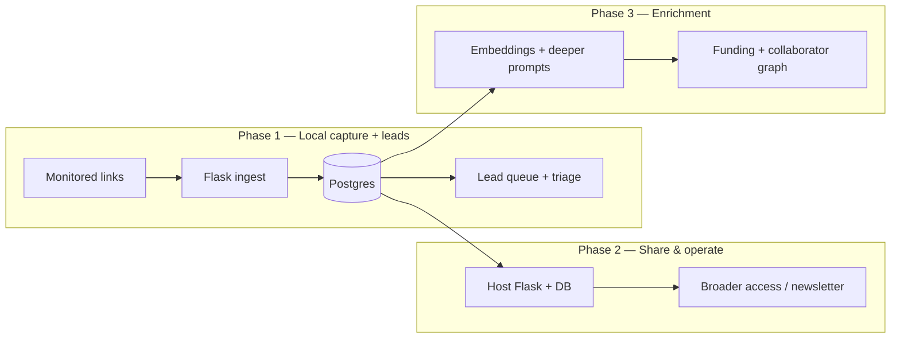

# Connection Maker — Local MVP & Stack

> An AI-assisted lead pipeline for the Neurotech Hub: **watch links → detect what’s new → turn it into actionable leads** you can triage locally.  
> *Down the road the same ingestion + Postgres core can drive newsletters, collaborator hints, and funding pathways — but the first win is leads.*

---

## What you’re building first

**MVP outcome:** register sources (RSS + HTML monitors), run a **poll** that dedupes into `content_item` and optional Ollama-derived `lead_candidate` rows, and operate from a **dual-surface Flask app**: a **public** landing (URL submission with duplicate detection, rate-limited POSTs) and a **password-gated `/admin`** workspace for CRUD plus **Poll now**. Default local DB is **SQLite** under `instance/`; point **`DATABASE_URL`** at Postgres when you want parity with production. Migrations: **`flask --app wsgi db upgrade`**. See [README.md](README.md) for run commands and env vars.

**Hosting posture**

- Ship as one **`wsgi.py` + SQLAlchemy** unit (not a static-only MVP).
- Postgres locally or on a server using the same `DATABASE_URL` the app already reads (install `psycopg[binary]`).
- **Later:** `gunicorn wsgi:app` (or similar) + optional **Ollama** on that host or another box.

### Public vs admin

| Surface | Path | Role |
|:---|:---|:---|
| **Public** | `/` | Synapse intro + “add a site to ingest”; URLs are **canonicalized**; duplicates get a clear flash message. |
| **Admin** | `/admin/*` | **`ADMIN_PASSWORD`** or **`ADMIN_PASSWORD_HASH`**. CRUD **sources** (incl. `enabled` / **`pending`** — pending sources are skipped by the poller), **leads**, **content items**; read-only **snapshot** list per source; dashboard with **Poll now** and **`poll_log`** history. |

---

## Environment variables (minimal)

| Variable | Purpose |
|:---|:---|
| `SECRET_KEY` | Flask session signing (set in any shared environment). |
| `ADMIN_PASSWORD` / `ADMIN_PASSWORD_HASH` | Operator login (prefer hash when not purely local). |
| `DATABASE_URL` | SQLAlchemy URI; omitted → SQLite `instance/synapse.db`. |
| `OLLAMA_HOST` / `OLLAMA_MODEL` | See [docs/ollama.md](docs/ollama.md). |

---

## Day-one MVP (local): checklist

| Step | Goal |
|:---|:---|
| 1 | PostgreSQL running locally; create a database (e.g. `synapse_mvp`). |
| 2 | Minimal schema applied (below). |
| 3 | Python venv + Flask + DB driver (`psycopg` or `asyncpg` + thin sync wrapper — your choice). |
| 4 | One **ingestion** path: RSS poll → dedupe → insert rows. |
| 5 | **Ollama** installed + one small instruct model pulled. |
| 6 | After new items arrive, POST to Ollama → write `lead_candidate` rows. |
| 7 | **Admin** leads: list / filter / edit / delete + **Export CSV** (`/admin/leads/export.csv`). |

RSS is the shortest path on day one; `html_page` can be second (fetch URL, strip boilerplate or hash raw body, compare to last snapshot).

---

## PostgreSQL — minimal MVP schema

This is deliberately small but maps cleanly onto the fuller “catalog → snapshots → derived facts” model when you expand.

```sql
-- What we poll (implemented in app/models.py + Alembic; boolean flags map to dialect)
CREATE TABLE source (
    id              SERIAL PRIMARY KEY,
    url             TEXT NOT NULL,
    kind            VARCHAR(32) NOT NULL,  -- e.g. 'rss_feed' | 'html_page'
    label           TEXT,
    enabled         BOOLEAN NOT NULL DEFAULT TRUE,
    pending         BOOLEAN NOT NULL DEFAULT FALSE,  -- excluded from automated poll when TRUE
    created_at      TIMESTAMPTZ NOT NULL DEFAULT NOW(),
    UNIQUE (url)
);

-- One row per feed item we’ve seen (RSS: use guid when present else stable hash of link+title)
CREATE TABLE content_item (
    id              SERIAL PRIMARY KEY,
    source_id       INT NOT NULL REFERENCES source(id) ON DELETE CASCADE,
    external_id     TEXT NOT NULL,
    title           TEXT,
    link            TEXT,
    published_at    TIMESTAMPTZ,
    snippet         TEXT,
    first_seen_at   TIMESTAMPTZ NOT NULL DEFAULT NOW(),
    UNIQUE (source_id, external_id)
);

-- Optional for HTML monitors: append-only fingerprints
CREATE TABLE source_snapshot (
    id              SERIAL PRIMARY KEY,
    source_id       INT NOT NULL REFERENCES source(id) ON DELETE CASCADE,
    fetched_at      TIMESTAMPTZ NOT NULL DEFAULT NOW(),
    body_sha256     CHAR(64) NOT NULL
);

-- Lead gen output tied to provenance (add html-only change hooks later via nullable FK patterns)
CREATE TABLE lead_candidate (
    id              SERIAL PRIMARY KEY,
    content_item_id INT REFERENCES content_item(id) ON DELETE CASCADE,
    headline        TEXT NOT NULL,
    angle           TEXT,
    outreach_snippet TEXT,
    hub_tags        TEXT,  -- comma or JSON text; tighten to jsonb later
    status          VARCHAR(32) NOT NULL DEFAULT 'new',  -- new | starred | done | archived
    model_used      TEXT,
    created_at      TIMESTAMPTZ NOT NULL DEFAULT NOW()
);

CREATE INDEX lead_candidate_status_idx ON lead_candidate (status);
CREATE INDEX content_item_seen_idx ON content_item (first_seen_at DESC);

-- Admin “Poll now” trail (append-only)
CREATE TABLE poll_log (
    id         SERIAL PRIMARY KEY,
    ran_at     TIMESTAMPTZ NOT NULL DEFAULT NOW(),
    ok         BOOLEAN NOT NULL,
    detail     TEXT
);
```

**Forward-compatible idea:** when you add diff-based HTML monitors, reuse `change_event`-style naming or add a nullable `change_event_id` on `lead_candidate`; the MVP above already anchors every lead to a `content_item` so you can always join back to `source`.

---

## Flask app layout (implemented)

```
Synapse/
  wsgi.py                  # gunicorn / flask --app wsgi
  app/
    __init__.py            # create_app() — use local name `flask_app` (not `app`) inside factory
    config.py
    extensions.py          # db, migrate, login_manager, limiter
    models.py
    auth.py
    ingest/
      urlnorm.py           # canonical URL helper for public submit + admin sources
      rss.py
      ollama_client.py
      pipeline.py          # run_poll() → RSS items + HTML snapshots + poll_log row
    web/
      public_routes.py
      admin/               # blueprint /admin
        forms.py
        routes.py
  templates/ public/ admin/
  static/   public.css admin.css
  migrations/            # Flask-Migrate / Alembic
  requirements.txt
```

**Ingestion pipeline (conceptual)**

1. Load `source` rows where `kind = 'rss_feed'`.
2. `GET` feed URL → parse with `feedparser` (or stdlib + defusedxml if you prefer).
3. For each entry, compute `external_id` = `id` or `hash(link + title)`.
4. `INSERT ... ON CONFLICT DO NOTHING` into `content_item`.
5. For rows that were **inserted** (new), build a short prompt from title + snippet + link.
6. Call Ollama; parse JSON or delimited response into `headline`, `angle`, `outreach_snippet`, `hub_tags`.
7. Insert `lead_candidate`.

Hash-only optimization for RSS is optional on day one; dedupe by `external_id` is enough.

---

## Ollama — install & a few key interactions

Full runbook (install options, env vars, troubleshooting, CI): **[docs/ollama.md](docs/ollama.md)**.  
Automated checks: install [requirements-dev.txt](requirements-dev.txt), then `pytest -m ollama` (uses `OLLAMA_HOST` / `OLLAMA_MODEL`; skips if the daemon is down). For CI without Ollama: `pytest -m "not ollama"` — see [README.md](README.md).

**Install (macOS)**

1. Download from [ollama.com](https://ollama.com) or `brew install ollama`.
2. Start the daemon (menu bar app or `ollama serve`).
3. Pull a small instruct model (good default for M-series with limited RAM: 3B–8B class):

```bash
ollama pull llama3.2
# or: ollama pull mistral
```

**One-liner shell smoke (optional)**

```bash
./scripts/ollama_smoke.sh
```

**Smoke test (terminal)**

```bash
curl -s http://127.0.0.1:11434/api/generate -d '{
  "model": "llama3.2",
  "prompt": "In one sentence, what is RSS?",
  "stream": false
}'
```

**Python (generate one lead from a new item)**

```python
import json
import requests

OLLAMA = "http://127.0.0.1:11434"
MODEL = "llama3.2"

def enrich_lead(title: str, link: str, snippet: str) -> dict:
    prompt = f"""You help a neurotech community hub find outreach leads.
Return ONLY valid JSON with keys: headline, angle, outreach_snippet, hub_tags (comma-separated string).

Title: {title}
URL: {link}
Snippet: {snippet}
"""
    r = requests.post(
        f"{OLLAMA}/api/generate",
        json={"model": MODEL, "prompt": prompt, "stream": False},
        timeout=120,
    )
    r.raise_for_status()
    text = r.json().get("response", "").strip()
    return json.loads(text)
```

Guardrails for a real MVP: strip markdown fences if the model wraps JSON, catch `JSONDecodeError` and store raw `text` in `angle` for manual fix.

**Other useful calls later**

- `/api/tags` — list pulled models.
- `/api/embeddings` — if you add `pgvector` and similarity over past leads (not required for day one).

---

## Lead output & management (Flask)

Minimum useful surface:

| Route / action | Behavior |
|:---|:---|
| `GET /admin/leads` | Table + status filter (`?status=…`). |
| `GET /admin/leads/<id>/edit` | Edit fields + **`status`** (`new`, `starred`, `done`, `archived`). |
| `GET /admin/leads/export.csv` | Optional **`?status=`**; pulls up to 2000 rows for mail-merge / Notion. |
| `GET/POST /admin/sources/…` | Full CRUD; add RSS/HTML sources without touching SQL. |

**Poll now:** `POST /admin/poll-now` writes a `poll_log` row (shown on the dashboard). For production you may later offload this to a background worker.

---

## Roadmap (still three phases, same throughline)



**Phase 1 (now):** Flask + Postgres + Ollama + leads.  
**Phase 2:** Deploy the same Flask app + DB behind a stable host — your call.  
**Phase 3:** Add `pgvector`, persona bundles, funding ontology — same tables, more columns and jobs.

---

## Fuller relational model (when you outgrow the MVP)

You can grow into the three-layer design without a rewrite:

- **Catalog:** `source`, tags/subjects for “who does this feed belong to.”
- **Truth:** `fetch_run`, `snapshot`, `change_event` for provable history and HTML diffs.
- **Derived:** `extracted_fact`, `entity`, `persona_bundle`, `relation_suggestion` for richer prompts and “AI as a saved graph,” not a one-off chat.

Indexes that pay off first: `(source_id, first_seen_at)`, dedupe keys, and `lead_candidate(status, created_at)`.

---

## Risks (short)

| Risk | Mitigation |
|:---|:---|
| Model returns garbage JSON | Store raw response; retry with stricter prompt; smaller model often more obedient with “JSON only.” |
| RSS duplicates / missing guids | Stable `external_id` from `link + title`; manual dedupe in UI if needed. |
| Flask + Postgres on a server | Standard `gunicorn` + env `DATABASE_URL`; run migrations once; Ollama colocated or separate service URL in config. |

---

## Summary

| Question | Answer |
|:---|:---|
| **MVP stack?** | Python **Flask**, **PostgreSQL**, **Ollama** on the same Mac. |
| **First ingestor?** | **RSS** (PubMed searches export to RSS); HTML hash-diff next. |
| **What ships in a day?** | Sources + poll + `content_item` + `lead_candidate` + minimal lead UI + CSV. |
| **What migrates cleanly?** | Same app and schema concepts move to a VPS; point `OLLAMA_HOST` at a GPU host when ready. |
